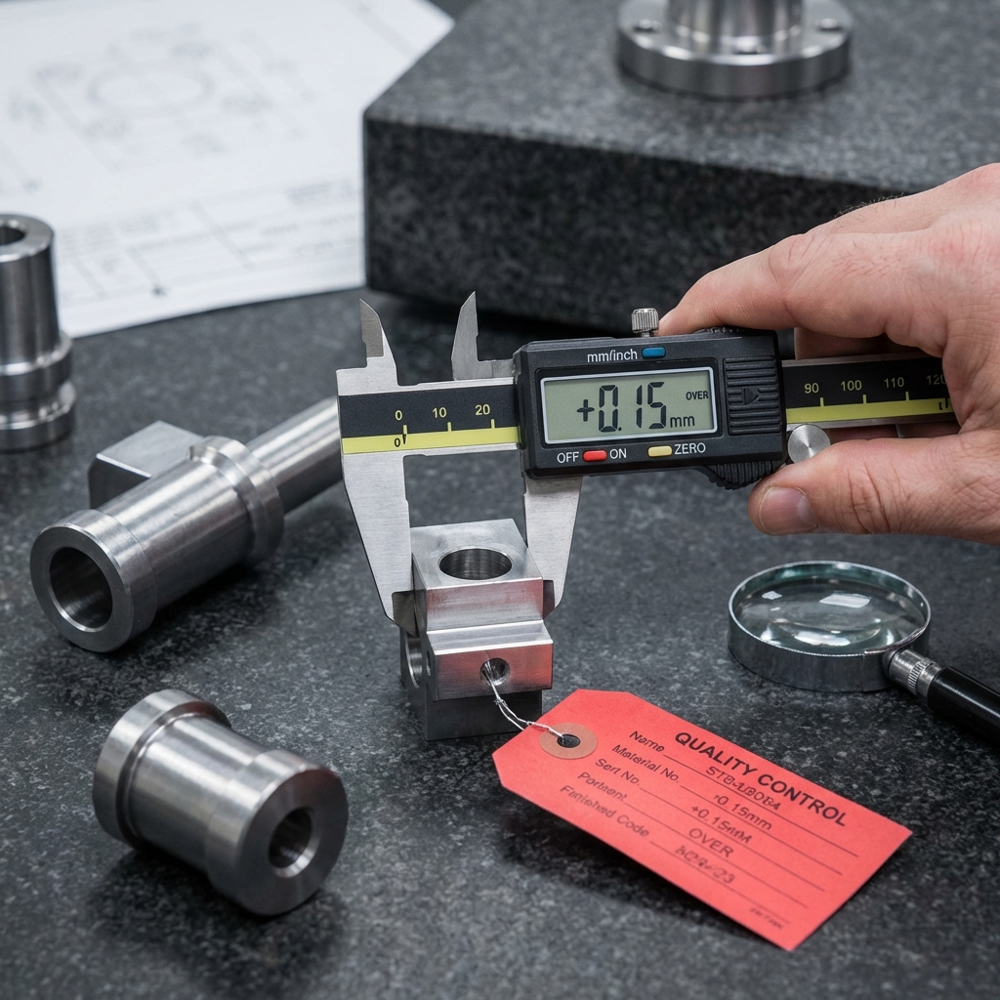
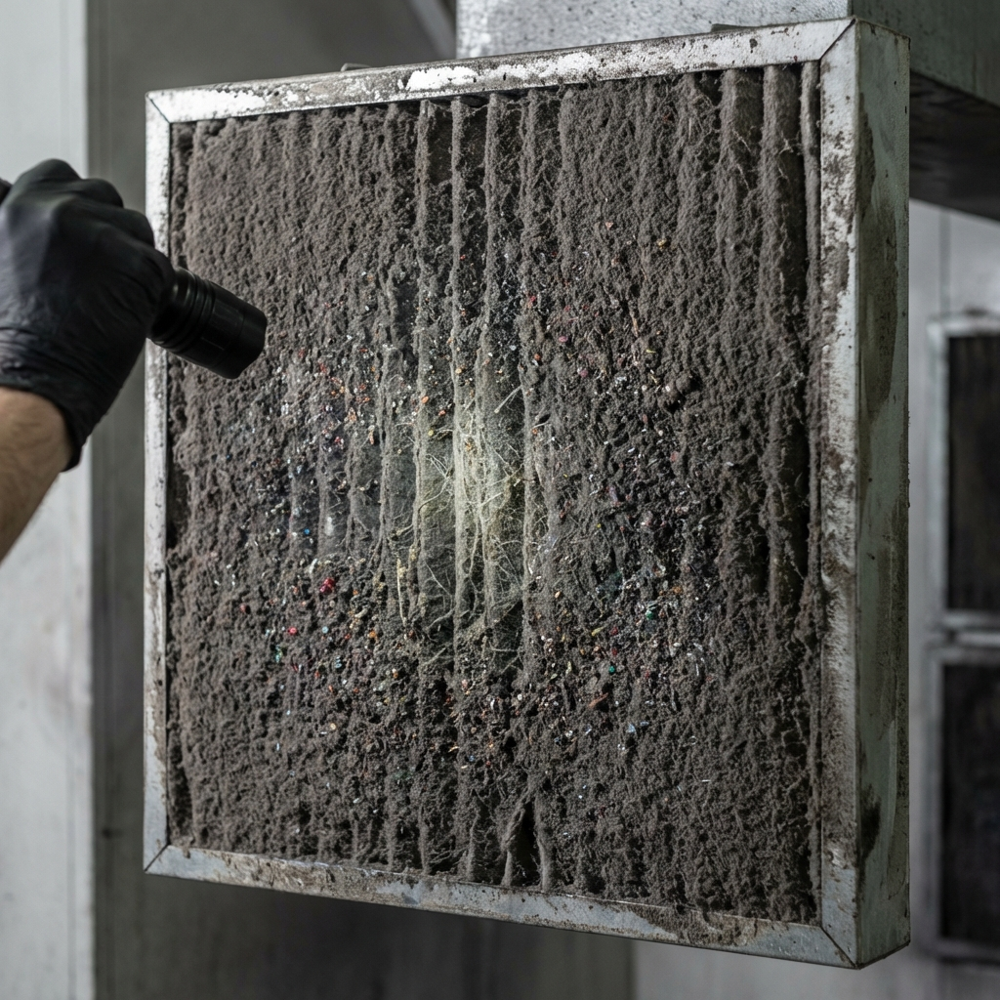
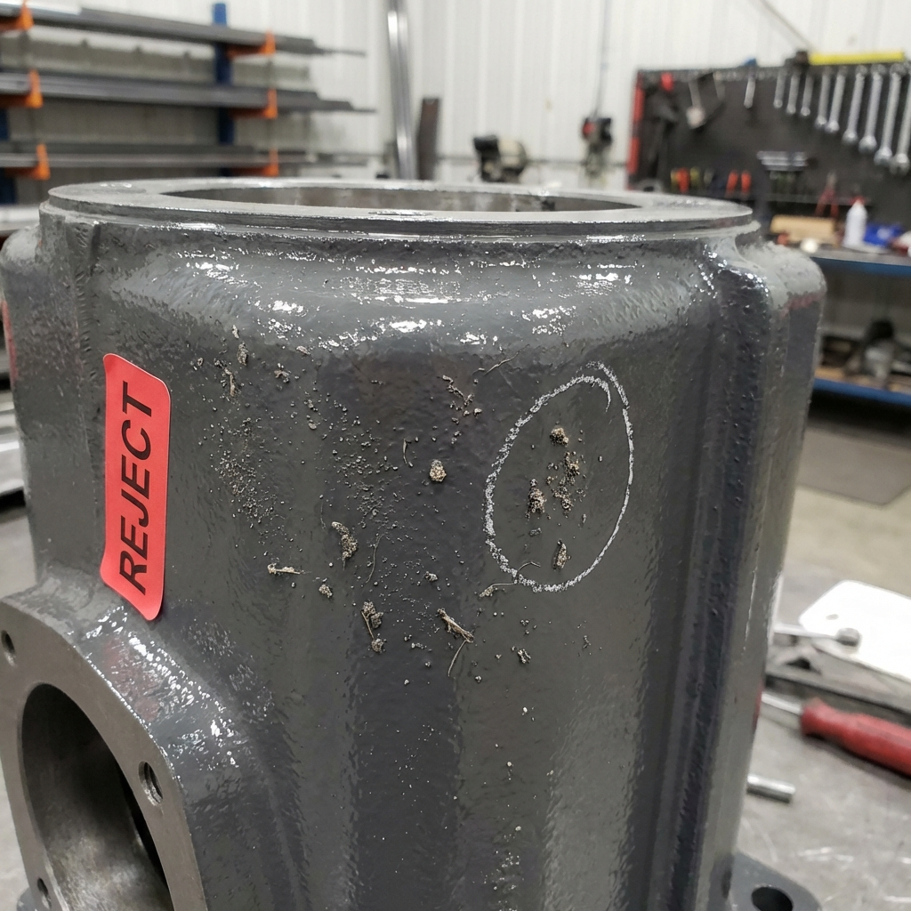
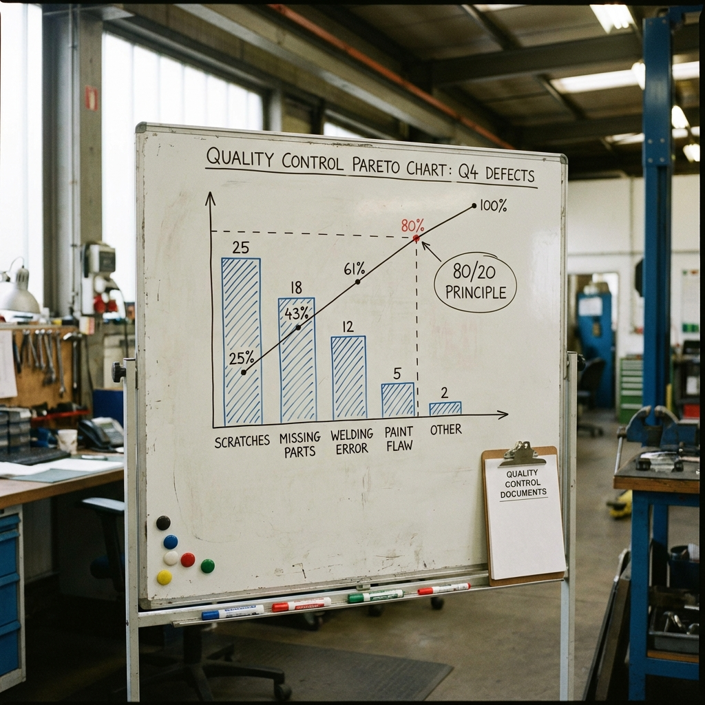

# 🖼️ Catalogue des Images - Jeux de Rôle

**12 images professionnelles générées pour illustrer les kits d'indices**

---

## 📂 Emplacement

Toutes les images sont dans le dossier : **`Images/`**

---

## 🎭 JdR n°1 - QRQC

| Image | Nom du fichier | Description | Utilisée dans |
|-------|----------------|-------------|---------------|
|  | `composant_defaut.png` | Condensateur monté à l'envers (polarité inversée) | Indice 1 |
|  | `composant_ok.png` | Condensateur correctement monté (référence) | Indice 2 |
|  | `detrompeur_casse.png` | Détrompeur mécanique D-104 cassé | Indice 7 (Genba) |

---

## 🎭 JdR n°2 - Méthode 8D

| Image | Nom du fichier | Description | Utilisée dans |
|-------|----------------|-------------|---------------|
|  | `pieces_hors_tolerance.png` | Pièces usinées avec mesures hors tolérances | Indice 3 |

---

## 🎭 JdR n°4 - Pareto

| Image | Nom du fichier | Description | Utilisée dans |
|-------|----------------|-------------|---------------|
|  | `filtre_encrasse.png` | Filtre de cabine peinture saturé | Indice 10 |
|  | `defauts_peinture.png` | Pièce peinte avec défauts poussières | Indice 11 |
|  | `diagramme_pareto.png` | Exemple de diagramme de Pareto | Indice 9 |

---

## 🎭 JdR n°5 - Poka-Yoke

| Image | Nom du fichier | Description | Utilisée dans |
|-------|----------------|-------------|---------------|
|  | `joints_toriques.png` | Joints toriques rouge et noir (similaires) | Indice 3 |
|  | `poste_desorganise.png` | Poste de travail désorganisé sans code couleur | Indice 4 |
|  | `poka_yoke_solution.png` | Exemple de solution Poka-Yoke (bacs colorés) | Indice 10 |

---

## 🎭 JdR n°6 - Kaizen/SMED

| Image | Nom du fichier | Description | Utilisée dans |
|-------|----------------|-------------|---------------|
|  | `shadow_board.png` | Shadow board (panneau outils avec ombres portées) | Indice 9 |
|  | `changement_serie.png` | Opérateur changeant les outils sur presse | Indice 4 |

---

## 💡 Utilisation dans les Kits

Les images sont référencées dans les kits avec la syntaxe markdown :

```markdown

```

Le chemin relatif `../Images/` fonctionne depuis les dossiers `JdR1_QRQC/`, `JdR2_Methode_8D/`, etc.

---

## 📊 Statistiques

- **Total** : 12 images
- **Taille totale** : ~9.5 MB
- **Format** : PNG (haute qualité)
- **Générées par** : IA (Google Gemini)
- **Date** : 16 janvier 2026

---

*Catalogue des images - Pôle Formation UIMM-CVDL*
