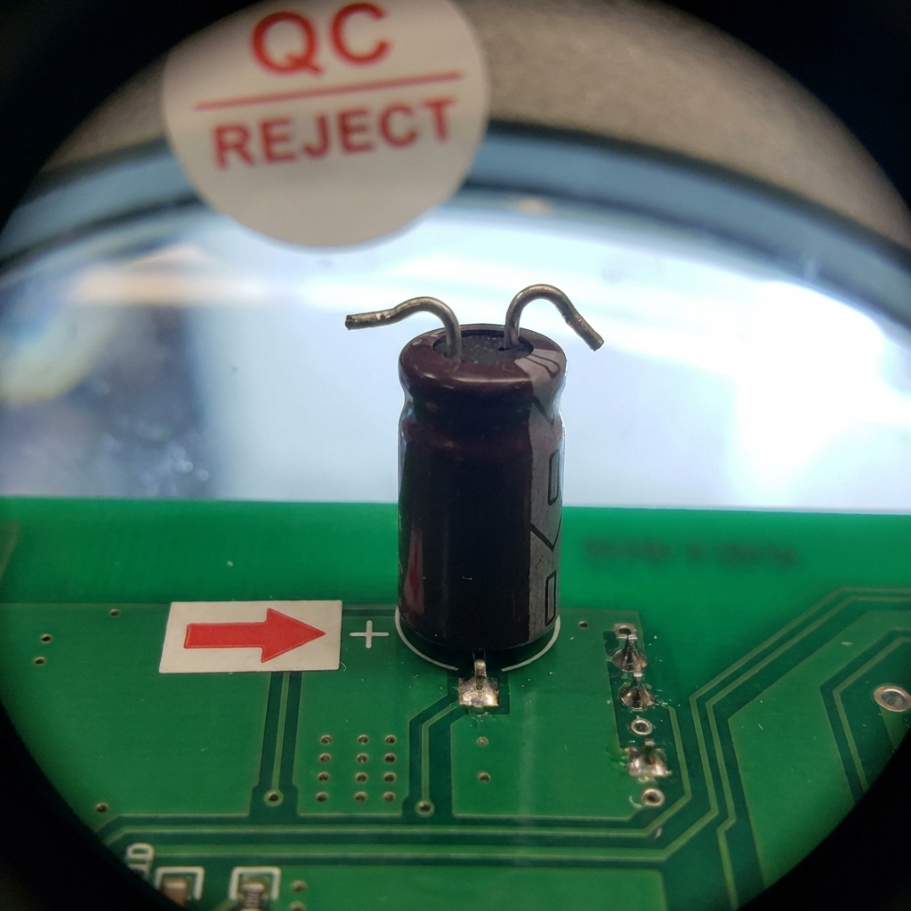
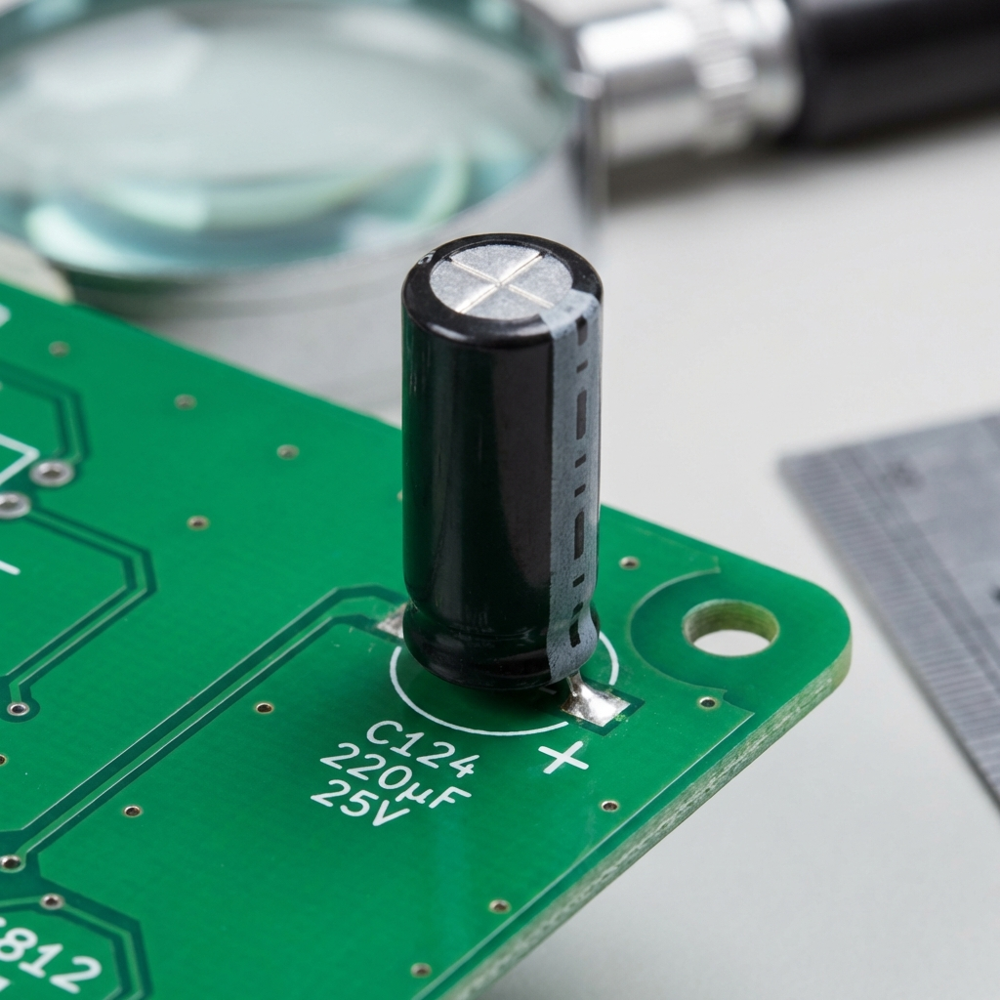
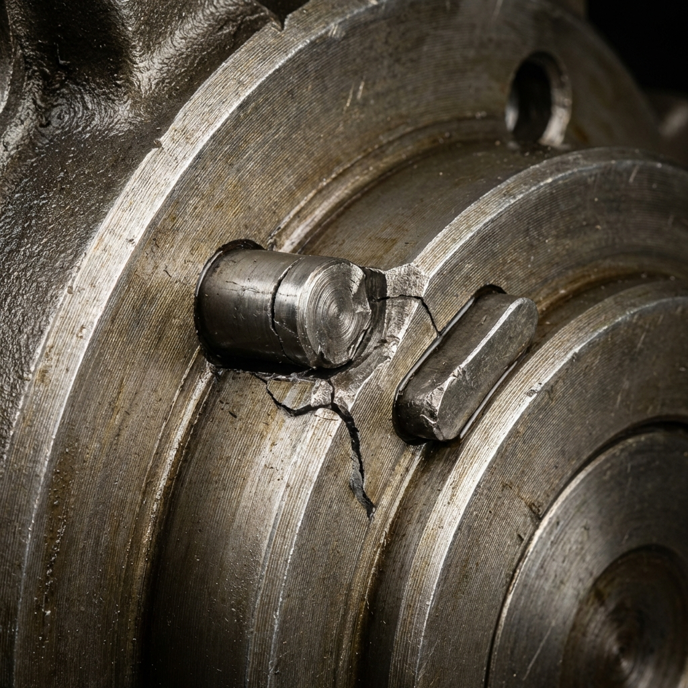

# Kit d'Indices - Jeu de Rôle n°1 : "QRQC de survie"

## 📋 Contexte de la Mission

**Date** : 16 janvier 2026  
**Heure de détection** : 14h30  
**Ligne** : Assemblage PCB - Ligne 3  
**Produit** : Carte électronique référence PCB-2024-A  
**Client** : TechnoSys Industries  
**Urgence** : ⚠️ Livraison prévue aujourd'hui à 18h00

---

## 📸 INDICE 1 : Photo du Composant Défectueux



**Légende** : Condensateur électrolytique détecté monté à l'envers lors du contrôle qualité. Marquage de polarité inversé. Référence : C104, 220µF/25V.

**Quantité détectée** : 12 pièces en cours de production (sur 150 du lot)

---

## 📸 INDICE 2 : Photo du Composant Correct (Référence)



**Légende** : Exemple de montage conforme - Condensateur C104 correctement orienté avec marquage de polarité aligné selon la gamme opératoire.

---

## 📋 INDICE 3 : Extrait Gamme Opératoire (Version Actuelle)

```
GAMME OPÉRATOIRE - PCB-2024-A
Version : 3.2 | Date : 10/01/2026 | Validée par : M. Dupont

OPÉRATION 40 : Insertion Condensateurs
─────────────────────────────────────────

Composant : C104 - Condensateur électrolytique 220µF/25V
Référence fournisseur : ELEC-CAP-220-25-RAD
Quantité : 2 par carte

INSTRUCTION MONTAGE :
1. Repérer le marquage de polarité sur le condensateur (bande blanche = négatif)
2. Aligner la bande blanche avec le marquage "-" sur le PCB
3. Insérer les pattes dans les trous H12 et H13
4. Vérifier l'orientation avec le gabarit de contrôle
5. Souder en respectant T° 350°C pendant 3s max

⚠️ ATTENTION : 
- La polarité doit être respectée IMPÉRATIVEMENT
- En cas de doute, utiliser le détrompeur mécanique (pièce D-104)
- Contrôle visuel obligatoire après insertion

DÉTROMPEUR : Pièce usinée D-104 positionnée sur le support
→ Ne permet l'insertion que dans le bon sens
```

---

## 📋 INDICE 4 : Extrait Gamme Opératoire PÉRIMÉE ⚠️

> **[À ne donner QUE si les participants demandent explicitement l'historique des versions]**

```
GAMME OPÉRATOIRE - PCB-2024-A
Version : 2.8 | Date : 15/11/2025 | OBSOLÈTE

OPÉRATION 40 : Insertion Condensateurs
─────────────────────────────────────────

Composant : C104 - Condensateur électrolytique 220µF/25V

INSTRUCTION MONTAGE :
1. Insérer le condensateur dans les trous H12 et H13
2. La bande blanche doit être côté gauche de la carte
3. Souder

NOTE : Suite modification PCB v3.0, orientation modifiée.
Voir version 3.0+ pour nouvelle orientation.
```

**PIÈGE** : Cette ancienne version indique "bande blanche côté gauche" alors que la nouvelle version du PCB a inversé l'orientation !

---

## 📋 INDICE 5 : Relevé de Production

```
LIGNE 3 - ASSEMBLAGE PCB-2024-A
Date : 16/01/2026

┌──────────┬───────────┬──────────┬─────────────┬──────────┐
│  Heure   │ Opérateur │ Quantité │ Contrôle QC │  Statut  │
├──────────┼───────────┼──────────┼─────────────┼──────────┤
│ 08h00    │ Sophie L. │    25    │    OK       │    ✓     │
│ 09h30    │ Sophie L. │    30    │    OK       │    ✓     │
│ 11h00    │ Marc T.   │    28    │    OK       │    ✓     │
│ 12h00    │ PAUSE DÉJEUNER                               │
│ 13h30    │ Marc T.   │    35    │    OK       │    ✓     │
│ 14h30    │ Marc T.   │    32    │  12 NOK!    │    ✗     │
└──────────┴───────────┴──────────┴─────────────┴──────────┘

Observation : Défauts détectés au contrôle final à 14h30
Tous les défauts concernent le composant C104 monté à l'envers
```

**Question clé pour QQOQCP** : Pourquoi le problème apparaît-il seulement à 14h30 ?

---

## 📋 INDICE 6 : Fiche QQOQCP Vierge (Outil à utiliser)

```
┌────────────────────────────────────────────────────────────┐
│           FICHE QQOQCP - ANALYSE DU PROBLÈME               │
└────────────────────────────────────────────────────────────┘

QUI ?
(Qui a détecté ? Qui est concerné ?)
_____________________________________________________________

QUOI ?
(Quel est le problème exact ? Quelle pièce ?)
_____________________________________________________________

OÙ ?
(Sur quelle ligne ? À quel poste ? Emplacement précis ?)
_____________________________________________________________

QUAND ?
(À quelle heure ? Depuis quand ? Fréquence ?)
_____________________________________________________________

COMMENT ?
(Comment le défaut se manifeste-t-il ?)
_____________________________________________________________

POURQUOI ?
(Cause probable ? À valider sur le terrain !)
_____________________________________________________________
```

---

## 🔍 INDICE 7 : Photo du Détrompeur

> **[PHOTO À NE RÉVÉLER QUE SI L'ÉQUIPE VA PHYSIQUEMENT SUR LA LIGNE INSPECTER LE POSTE]**
> **Condition : Les participants doivent dire explicitement "Nous allons sur la ligne pour examiner le support de montage"**



**Légende** : Pièce D-104 (détrompeur mécanique) - Cassée !  
**Date de constat** : [À la date où l'équipe l'inspecte]

**Révélation** : Le détrompeur mécanique qui empêche normalement une insertion incorrecte est CASSÉ. Personne ne l'avait signalé.

---

## 📋 INDICE 8 : Historique Maintenance

> **[À fournir SI demandé explicitement]**

```
LIGNE 3 - POSTE INSERTION C104

DERNIÈRES INTERVENTIONS :
───────────────────────────

15/01/2026 - 17h30 : Nettoyage hebdomadaire (Sarah M.)
       → Aucune anomalie signalée

10/01/2026 - 10h00 : Changement de bobine de soudure
       → Support de composants nettoyé

03/01/2026 - 14h00 : Maintenance préventive
       → Vérification supports et gabarits
       → État : Conforme
```

**PIÈGE** : Aucune mention du détrompeur cassé dans les fiches ! Il a probablement été cassé entre le 10/01 et le 16/01 sans être signalé.

---

## 📋 INDICE 9 : Témoignage Opérateur (Si interrogé)

**Marc T. (Opérateur)** :

> "Oui, j'ai monté ces condensateurs ce matin et cet après-midi. J'ai remarqué que le support bougeait un peu plus que d'habitude, mais j'ai pensé que c'était normal. La pièce guide (le petit machin en métal) me semblait bizarre, mais je ne suis pas sûr... Je me concentre surtout sur la cadence, on doit en faire 35 par heure minimum. Ce matin tout allait bien, je ne comprends pas ce qui s'est passé."

**Questions de relance possibles** :

- "À quelle heure avez-vous remarqué que le support bougeait ?"
- "Avez-vous signalé cette anomalie ?"
- "Pouvez-vous nous montrer exactement où se trouve 'le petit machin en métal' ?"

---

## 📋 INDICE 10 : Témoignage Chef d'Équipe (Si interrogé)

**Sabrina D. (Chef d'équipe)** :

> "On a 150 cartes à livrer ce soir impérativement. Le client nous a déjà pénalisés le mois dernier pour un retard. Je comprends qu'il y a un problème, mais est-ce qu'on ne peut pas trier les bonnes et les mauvaises et continuer la production ? On a le temps de refaire les 12 défectueuses si on ne s'arrête pas maintenant."

**PIÈGE PÉDAGOGIQUE** : Le chef d'équipe pousse à NE PAS arrêter la ligne (violation du principe d'Auto-Qualité).

---

## 🎯 SOLUTION ATTENDUE (Pour le Formateur)

### Principe des 3 Réels (San Gen Shugi)

1. **Genba** (Le vrai lieu) : Aller SUR la ligne, au poste de travail
2. **Genbutsu** (La vraie pièce) : Examiner le support de montage et le détrompeur
3. **Genjitsu** (La réalité) : Constater que le détrompeur D-104 est cassé

### Analyse QQOQCP Correcte

- **QUI** : Opérateur Marc T., mais pas sa faute (système défaillant)
- **QUOI** : Condensateur C104 monté à l'envers (12 pièces)
- **OÙ** : Ligne 3, poste insertion composants
- **QUAND** : Détecté 14h30, probablement depuis le début de l'après-midi
- **COMMENT** : Détrompeur mécanique D-104 cassé → permet montage dans les deux sens
- **POURQUOI** : Absence de signalement de la défaillance du détrompeur

### Actions Immédiates (QRQC)

1. ✋ **ARRÊT de la ligne** (Auto-Qualité) ← Décision difficile mais nécessaire
2. 🔧 **Remplacer le détrompeur D-104** immédiatement
3. 🔍 **Contrôler les 32 pièces** produites cet après-midi (pas que les 12 détectées)
4. ♻️ **Reprendre les pièces défectueuses** (déssoudage + remontage)
5. 📋 **Mettre à jour la check-list maintenance** pour inclure vérification du détrompeur

### Cause Racine

**Défaillance du système de détection** : Le détrompeur cassé n'a pas été signalé lors du nettoyage du 15/01. Manque de sensibilisation à l'importance de signaler toute anomalie même "mineure".

---

## ⏱️ Déroulé Pédagogique Attendu

| Temps | Phase | Action Équipe |
|-------|-------|---------------|
| 0-5 min | Prise de connaissance | Lecture des indices 1, 2, 3, 5 |
| 5-10 min | Discussion | Tentation de "trier et continuer" |
| 10-15 min | Décision | Choix : arrêter ou continuer ? |
| 15-25 min | Investigation | Remplir QQOQCP, interroger opérateur |
| 25-30 min | Genba | ALLER sur la ligne (obtention indice 7) |
| 30-35 min | Eurêka ! | Découverte du détrompeur cassé |
| 35-40 min | Plan d'action | Définition des actions correctives |

---

## 📝 Points de Débriefing

### Comportements Recherchés ✅

- Décision d'arrêter la ligne (courage du chef d'équipe)
- Aller physiquement sur le terrain (pas de supposition à distance)
- Utiliser l'outil QQOQCP de manière structurée
- Chercher la vraie pièce, pas seulement les documents

### Erreurs Fréquentes ❌

- Vouloir continuer à produire (pression délai)
- Accuser l'opérateur sans analyser le système
- Regarder seulement les documents sans aller sur le terrain
- S'arrêter à la première cause (ex: "l'opérateur s'est trompé")

### Messages Clés

1. **Auto-Qualité** : Mieux vaut arrêter 30 min que livrer du défaut
2. **San Gen Shugi** : La vérité est sur le terrain, pas dans les bureaux
3. **Culture non-punitive** : L'opérateur n'est pas fautif, c'est le système
4. **Signalement d'anomalie** : Toute anomalie doit être signalée immédiatement

---

**Durée totale du jeu** : 40-45 minutes  
**Débriefing** : 15-20 minutes  

*Kit créé pour la formation QRQC - Résolution de Problèmes*  
*Pôle Formation UIMM - CVDL*
