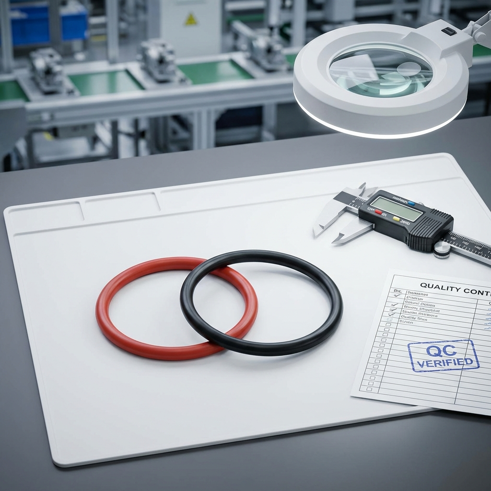
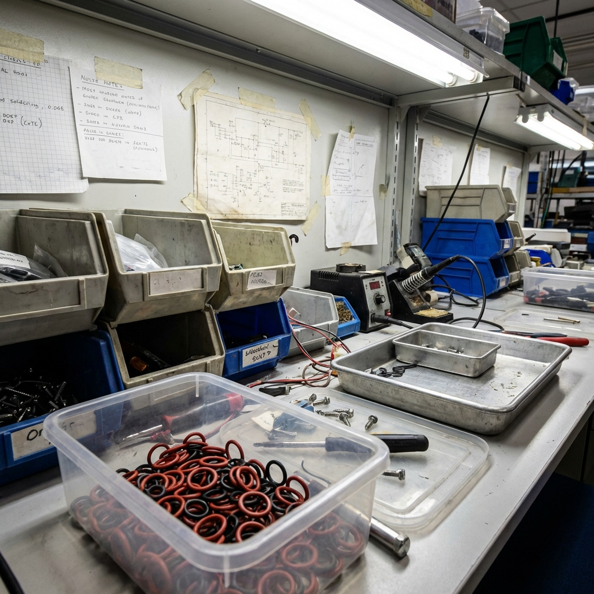
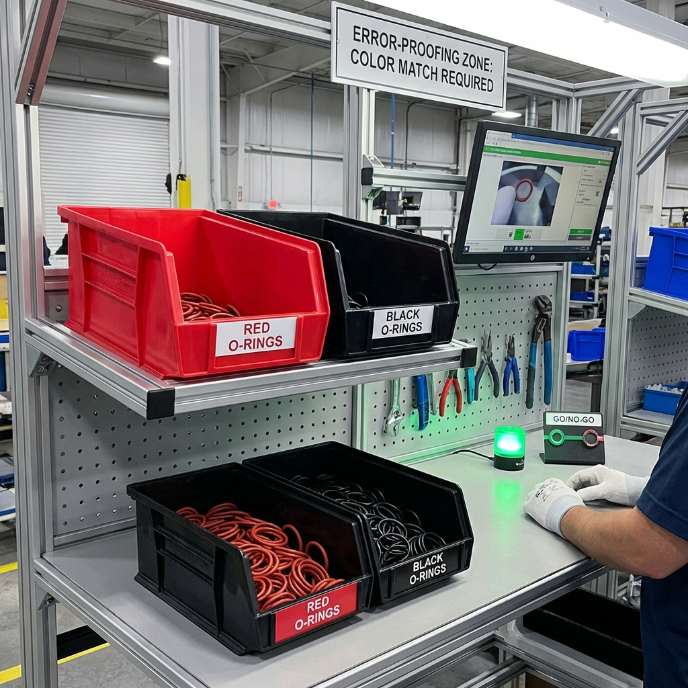

# Kit d'Indices - Jeu de Rôle n°5 : "Le Poka-Yoke Salvateur"

## 📋 Contexte de la Mission

**Date** : 16 janvier 2026  
**Ligne** : Assemblage connecteurs hydrauliques - Ligne H2  
**Produit** : Connecteur série HydroFit-Pro  
**Problème** : 15% de défauts au contrôle final (joints toriques inversés)  
**Impact** : Gaspillage, retravail, risque client  
**Budget disponible** : 500€ maximum

---

## 📊 INDICE 1 : Statistiques des Défauts (6 derniers mois)

```
TAUX DE DÉFAUTS - JOINTS TORIQUES INVERSÉS
Ligne H2 - Connecteurs HydroFit-Pro

┌────────────┬─────────────┬──────────┬──────────┐
│    Mois    │ Production  │ Défauts  │  Taux %  │
├────────────┼─────────────┼──────────┼──────────┤
│ Août 2025  │   2 450     │   385    │  15.7%   │
│ Sept 2025  │   2 680     │   402    │  15.0%   │
│ Oct 2025   │   2 320     │   348    │  15.0%   │
│ Nov 2025   │   2 890     │   433    │  14.9%   │
│ Déc 2025   │   2 150     │   323    │  15.0%   │
│ Janv 2026  │   1 340     │   201    │  15.0%   │
└────────────┴─────────────┴──────────┴──────────┘

📈 CONSTAT : Le taux reste stable à ~15% malgré :
   ✓ Formations répétées des opérateurs (3 sessions)
   ✓ Affichage de consignes au poste
   ✓ Rappels quotidiens en réunion de démarrage

💡 CONCLUSION : La formation seule ne résout PAS le problème
              → Nécessite une solution SYSTÉMIQUE (Poka-Yoke)
```

---

## 📋 INDICE 2 : Répartition des Défauts par Opérateur

```
ANALYSE PAR OPÉRATEUR - Décembre 2025

┌──────────────┬────────────┬──────────┬──────────┬────────────┐
│  Opérateur   │ Expérience │ Quantité │ Défauts  │  Taux %    │
├──────────────┼────────────┼──────────┼──────────┼────────────┤
│ Claire M.    │  8 ans     │   680    │   102    │   15.0%    │
│ Ahmed K.     │  5 ans     │   520    │    78    │   15.0%    │
│ Lucie P.     │  12 ans    │   450    │    68    │   15.1%    │
│ Thomas R.    │  2 ans     │   500    │    75    │   15.0%    │
└──────────────┴────────────┴──────────┴──────────┴────────────┘

⚠️ OBSERVATION CRITIQUE :
Le taux d'erreur est IDENTIQUE pour tous les opérateurs,
y compris les plus expérimentés (Lucie : 12 ans d'ancienneté).

→ Ce n'est PAS un problème de compétence individuelle
→ C'est un problème de CONCEPTION DU POSTE
```

---

## 📸 INDICE 3 : Les Joints Toriques (Comparaison Visuelle)



**Caractéristiques** :

- **Joint ROUGE** : NBR (Nitrile) - pour circuit hydraulique haute pression
- **Joint NOIR** : EPDM - pour circuit retour basse pression

**Dimensions** :

- Diamètre intérieur : 12.0 mm (identique)
- Section : 2.0 mm (identique)
- Différence UNIQUEMENT : la couleur du matériau

**Problème** :

- En cadence normale (18 pièces/heure), l'opérateur prend un joint sans regarder attentivement
- Les joints sont mélangés dans le même bac transparent
- Sous éclairage atelier, la différence rouge/noir est subtile
- L'erreur n'est détectée qu'au contrôle visuel final (après assemblage complet)

---

## 📸 INDICE 4 : Poste de Travail Actuel (État des lieux)



**Constat** :

- Bacs transparents génériques (sans identification couleur)
- Joints rouges et noirs dans des bacs séparés MAIS identiques visuellement
- Bacs placés côte à côte → facilite la confusion
- Opérateur prend les joints "en aveugle" pour tenir la cadence
- Aucun système de guidage visuel ou tactile

---

## 📋 INDICE 5 : Gamme Opératoire Actuelle

```
GAMME D'ASSEMBLAGE - HydroFit-Pro
Référence : GA-H2-024 | Version 2.1

OPÉRATION 30 : Pose Joints Toriques
────────────────────────────────────────────────

Temps alloué : 45 secondes par connecteur

SÉQUENCE :
1. Prendre le corps du connecteur
2. Installer le joint ROUGE sur la gorge supérieure (Ø12 HP)
3. Installer le joint NOIR sur la gorge inférieure (Ø12 BP)
4. Vérifier visuellement les couleurs
5. Passer au vissage (OP 40)

⚠️ ATTENTION QUALITÉ :
   Le joint ROUGE doit être en position HAUTE
   Le joint NOIR doit être en position BASSE
   
   En cas de doute, SE RÉFÉRER À LA FICHE ILLUSTRÉE
   au-dessus du poste de travail.

CONTRÔLE : Inspection visuelle à 100% au poste suivant
```

**Note** : Malgré cette instruction claire, 15% d'erreurs persistent !

---

## 💡 INDICE 6 : Exemples de Poka-Yoke Simples (Inspiration)

### Principe du Poka-Yoke

Système anti-erreur qui rend **IMPOSSIBLE** ou **TRÈS DIFFICILE** de commettre une erreur.

### Catégories de Poka-Yoke

| Type | Description | Exemple | Coût |
|------|-------------|---------|------|
| **Physique** | Empêche physiquement l'erreur | Détrompeur USB (ne rentre que dans un sens) | € |
| **Visuel** | Rend l'erreur immédiatement visible | Code couleur, formes différentes | € |
| **Séquentiel** | Force un ordre d'opération | Vous ne pouvez pas retirer la carte avant la fin du paiement | €€ |
| **Détection** | Alerte en cas d'erreur | Alarme sonore si ceinture non attachée | €€€ |

### Exemples Industriels Peu Coûteux

```
1. BACS COLORÉS
   → Bac rouge pour pièces rouges, bac noir pour pièces noires
   Coût : ~20€/bac

2. GABARITS DE PRÉLÈVEMENT
   → Couvercle rainuré ne laissant passer qu'un joint à la fois
   Coût : ~50€ (fabrication interne)

3. SÉPARATION PHYSIQUE
   → Distance de 50cm entre les bacs (oblige à lever les yeux)
   Coût : 0€ (réorganisation)

4. SHADOW BOARD (Ombres portées)
   → Forme dessinée au poste indiquant où placer chaque chose
   Coût : ~10€ (peinture + pochoirs)

5. BACS AVEC CAPTEUR
   → Alerte si on prélève dans le mauvais bac selon séquence
   Coût : ~450€ (électronique + programmation)
```

---

## 📋 INDICE 7 : Contraintes Budgétaires

```
BUDGET DISPONIBLE : 500€ MAX

Décomposition autorisée :
┌─────────────────────────────┬──────────┐
│ Poste de dépense            │ Budget   │
├─────────────────────────────┼──────────┤
│ Matériel (bacs, supports)   │  300€    │
│ Fabrication interne (temps) │  100€    │
│ Électronique/capteurs       │  100€    │
└─────────────────────────────┴──────────┘

⚠️ PAS de budget pour :
   ✗ Systèmes de vision industrielle
   ✗ Automates programmables
   ✗ Robots de prélèvement automatique

✓ Encouragé : Solutions SIMPLES et ROBUSTES
```

---

## 📋 INDICE 8 : Témoignage Opératrice Expérimentée

**Claire M. (8 ans d'expérience, opératrice principale)** :

> "Franchement, ces joints se ressemblent TROP. En début de poste, je fais attention, mais après 2-3 heures à la cadence de 18 pièces/heure, mes gestes deviennent automatiques. Je sais que le rouge va en haut et le noir en bas, mais quand je plonge ma main dans le bac, je ne regarde pas toujours. C'est machinal. Il faudrait qu'on ne puisse PAS se tromper, même en étant fatigué ou distrait. Moi, ce que je ferais ? Des bacs de couleurs différentes : rouge pour les joints rouges, noir pour les joints noirs. Comme ça, même du coin de l'œil, je verrais la différence. Et peut-être les espacer plus, pour qu'on soit obligé de bouger la main différemment."

---

## 📋 INDICE 9 : Retour d'Expérience Autres Postes

```
BENCHMARK INTERNE - Solutions Poka-Yoke en place

POSTE A3 - Assemblage Vannes :
──────────────────────────────
Problème initial : Confusion vis M6 / M8 (tailles proches)
Solution mise en place (2024) :
   → Bacs de couleurs différentes (bleu = M6, vert = M8)
   → Couvercles avec trou unique (Ø6mm pour M6, Ø8mm pour M8)
   → Opérateur ne peut prélever qu'UNE vis à la fois
   
Coût : 85€ (4 bacs + fabrication couvercles)
Résultat : Taux d'erreur de 12% → 0.5% en 3 mois
ROI : Rentabilisé en 2 semaines


POSTE B7 - Câblage Électrique :
────────────────────────────────
Problème initial : Inversion câbles rouge/noir
Solution mise en place (2023) :
   → Marquage au sol en rouge et noir
   → Bacs suspendus à 1m de distance (force déplacement)
   → Étiquettes XXL avec pictogrammes
   
Coût : 35€ (peinture + crochets + étiquettes)
Résultat : Taux d'erreur de 8% → 0% en 1 mois
ROI : Rentabilisé en 1 semaine
```

**Leçon** : Les solutions simples et visuelles sont les plus efficaces !

---

## 📸 INDICE 10 : Exemple de Solution Poka-Yoke (Photo Référence)



**Description de la solution photographiée** :

- Bacs rouges pour joints rouges
- Bacs noirs pour joints noirs
- Étiquetage clair et visible
- Rangement organisé et accessible
- Principe de management visuel appliqué

**Cette photo peut servir d'inspiration mais l'équipe doit proposer SA solution adaptée !**

---

## 🎯 GRILLE D'ÉVALUATION DES SOLUTIONS (Outil fourni)

```
┌────────────────────────────────────────────────────────────┐
│     GRILLE D'ANALYSE POKA-YOKE - CRITÈRES DE SÉLECTION     │
└────────────────────────────────────────────────────────────┘

Solution proposée : ____________________________ _____________

┌──────────────────┬─────────┬─────────┬─────────┬─────────┐
│     CRITÈRE      │ Faible  │  Moyen  │  Bon    │Excellent│
│                  │  (1)    │   (2)   │  (3)    │  (4)    │
├──────────────────┼─────────┼─────────┼─────────┼─────────┤
│ EFFICACITÉ       │         │         │         │         │
│ (empêche erreur) │         │         │         │         │
├──────────────────┼─────────┼─────────┼─────────┼─────────┤
│ SIMPLICITÉ       │         │         │         │         │
│ (facile à utili.)│         │         │         │         │
├──────────────────┼─────────┼─────────┼─────────┼─────────┤
│ COÛT             │  >500€  │ 300-500€│ 100-300€│  <100€  │
│                  │         │         │         │         │
├──────────────────┼─────────┼─────────┼─────────┼─────────┤
│ MAINTENANCE      │ Complexe│ Régulière│ Faible │ Aucune  │
│                  │         │         │         │         │
├──────────────────┼─────────┼─────────┼─────────┼─────────┤
│ DÉLAI DE MISE    │  >1mois │ 2-4 sem.│ 1 sem.  │  1 jour │
│ EN ŒUVRE         │         │         │         │         │
├──────────────────┼─────────┼─────────┼─────────┼─────────┤
│ ROBUSTESSE       │  Fragile│  Moyen  │  Solide │Très solid│
│                  │         │         │         │         │
└──────────────────┴─────────┴─────────┴─────────┴─────────┘

                               SCORE TOTAL : ____ / 24

Recommandation : Score > 18 → Solution EXCELLENTE
                Score 12-18 → Solution ACCEPTABLE
                Score < 12  → À retravailler
```

---

## 📋 INDICE 11 : Cahier des Charges de la Solution Idéale

```
SPÉCIFICATIONS FONCTIONNELLES

DOIT (Obligatoire) :
✓ Empêcher ou réduire drastiquement l'erreur d'inversion
✓ Fonctionner même si l'opérateur est distrait ou fatigué
✓ Coûter moins de 500€
✓ Ne pas ralentir la cadence (18 pièces/heure minimum)
✓ Être simple à comprendre (pas de formation complexe)

DEVRAIT (Souhaitable) :
✓ Ne nécessiter aucune maintenance
✓ Être déployable en moins d'une semaine
✓ Pouvoir être répliqué sur d'autres postes
✓ Améliorer l'ergonomie du poste de travail

NE DOIT PAS (Contraintes) :
✗ Nécessiter un système informatique ou électronique complexe
✗ Dépendre de l'éclairage (doit marcher même si néon HS)
✗ Se détériorer rapidement (pas de consommables)
```

---

## 🎯 SOLUTION ATTENDUE (Pour le Formateur)

### Solution Optimale : "Système 3-en-1"

#### Composante 1 : BACS COLORÉS (Visuel)

- **Bac ROUGE** pour joints rouges
- **Bac NOIR** pour joints noirs
- Contraste visuel évident, même en vision périphérique
- **Coût** : 40€ (2 bacs couleur standard)

#### Composante 2 : COUVERCLES RAINURÉS (Physique)

- Couvercle avec fente unique permettant de prélever 1 seul joint
- Force l'opérateur à prélever consciemment (pas de prise "en vrac")
- Fabriqué en interne (découpe PVC ou impression 3D)
- **Coût** : 60€ (matériau + temps fabrication)

#### Composante 3 : SÉPARATION SPATIALE (Ergonomique)

- Bac rouge positionné côté GAUCHE (pour gorge supérieure)
- Bac noir positionné côté DROIT (pour gorge inférieure)
- Distance : 40-50 cm → force un mouvement distinct
- Association spatiale position bac ↔ position sur pièce
- **Coût** : 0€ (réorganisation)

#### Bonus : MARQUAGE AU SOL (Management Visuel)

- Adhésif rouge au sol sous bac rouge
- Adhésif noir au sol sous bac noir
- Renforce l'association mentale
- **Coût** : 15€ (ruban adhésif industriel)

### COÛT TOTAL : 115€

### Bénéfices Attendus

- ✅ Taux d'erreur : 15% → < 1% (objectif)
- ✅ Zéro ralentissement cadence
- ✅ Solution réplicable sur 12 postes similaires
- ✅ ROI : < 2 semaines
- ✅ Maintenance : AUCUNE

---

## ⏱️ Déroulé Pédagogique Attendu

| Temps | Phase | Action Équipe |
|-------|-------|---------------|
| 0-5 min | Cadrage | Lecture problème, contraintes, budget |
| 5-15 min | Idéation | Brainstorming solutions (encourager créativité) |
| 15-20 min | Piège | Tentation solution high-tech complexe |
| 20-30 min | Analyse | Utilisation grille d'évaluation sur 2-3 solutions |
| 30-35 min | Décision | Sélection solution optimale |
| 35-45 min | Prototype | Schéma ou maquette rapide de la solution |

---

## 📝 Points de Débriefing

### Principes Poka-Yoke à Retenir ✅

1. **KISS** : Keep It Simple, Stupid
   - Les meilleures solutions sont souvent les plus simples
   - La complexité crée de nouvelles opportunités d'erreur

2. **Visuel > Procédure**
   - Une couleur est plus efficace qu'une instruction écrite
   - Le cerveau traite les couleurs instantanément

3. **Physique > Comportemental**
   - Changer le système plutôt que compter sur la vigilance
   - Les humains se fatiguent, les systèmes non

4. **Prévention > Détection**
   - Mieux vaut EMPÊCHER l'erreur que la détecter après
   - Coût de prévention << Coût correction

### Messages Clés 💡

> "Le meilleur Poka-Yoke est celui qui rend l'erreur physiquement IMPOSSIBLE"

> "Si un opérateur expérimenté fait des erreurs, c'est le SYSTÈME qui est mal conçu, pas l'opérateur"

> "Commencez simple : bacs colorés + séparation = 80% du résultat pour 20% du coût"

---

**Durée totale du jeu** : 45 minutes  
**Débriefing** : 20 minutes  
**Mise en œuvre réelle** : 1-2 jours

*Kit créé pour la formation Poka-Yoke - Systèmes Anti-Erreur*  
*Pôle Formation UIMM - CVDL*
