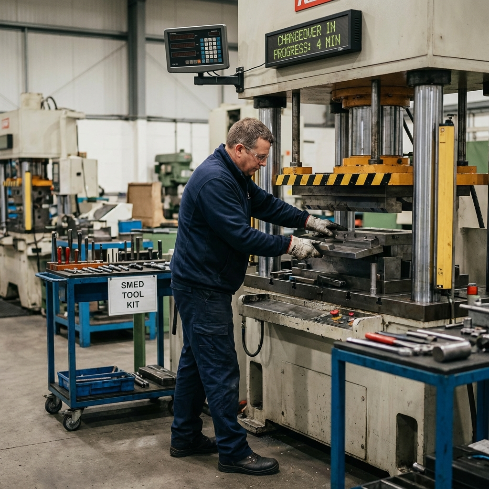
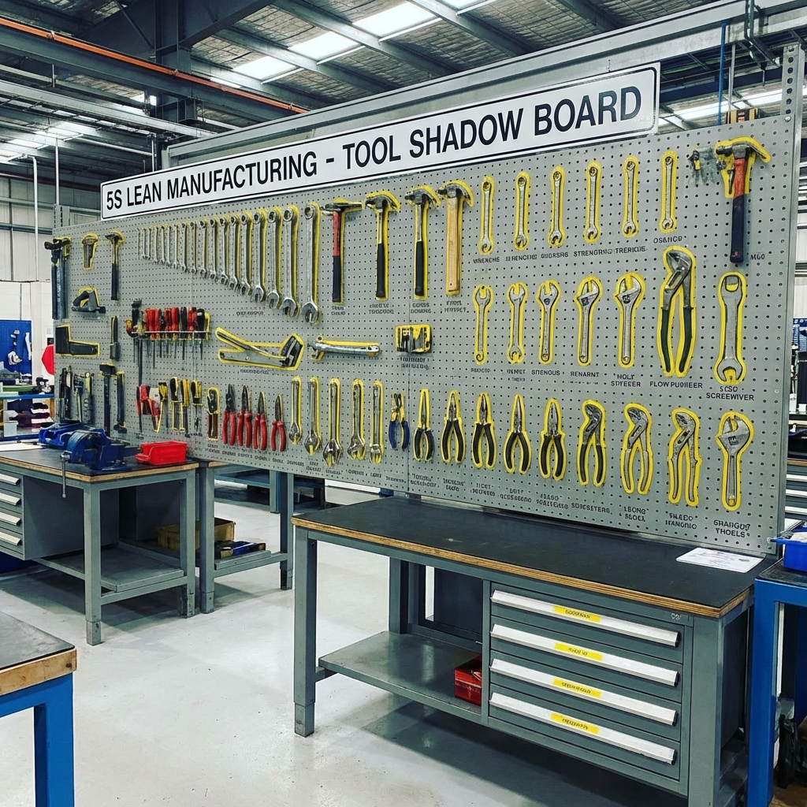

# Kit d'Indices - Jeu de Rôle n°6 : "Le Kaizen Blitz de l'Impossible"

## 📋 Contexte de la Mission

**Date** : 16 janvier 2026  
**Heure de début Kaizen** : 09h00  
**Durée du Kaizen Blitz** : 2 heures chrono ⏰  
**Machine** : Presse hydraulique 250T - Atelier emboutissage  
**Problème** : Changement de série = 45 minutes (inacceptable selon Lean)  
**Objectif** : Réduire de 50% (passer à 22 min max)  
**Budget disponible** : 0€ (solutions maison uniquement)  
**Méthode** : SMED (Single Minute Exchange of Die)

---

## 📊 INDICE 1 : Temps de Changement Actuels (Historique)

```
TEMPS DE CHANGEMENT DE SÉRIE - PRESSE 250T

┌────────────┬─────────────────┬────────────┬─────────────┐
│    Date    │  Série sortante │   Temps    │  Régleur    │
├────────────┼─────────────────┼────────────┼─────────────┤
│ 08/01/2026 │ Pièce A → B     │  47 min    │ Michel D.   │
│ 10/01/2026 │ Pièce B → C     │  43 min    │ Michel D.   │
│ 12/01/2026 │ Pièce C → A     │  46 min    │ Sophie L.   │
│ 15/01/2026 │ Pièce A → D     │  44 min    │ Michel D.   │
└────────────┴─────────────────┴────────────┴─────────────┘

📊 MOYENNE : 45 minutes
📊 MEILLEUR TEMPS : 43 minutes (variation faible)

⚠️ BENCHMARK LEAN :
Selon standards Lean/Toyota, un changement série devrait 
être réalisé en temps "SMED" = Single Minute Exchange Die
→ Moins de 10 minutes pour une presse simple
→ Moins de 20 minutes pour presse complexe

NOTRE OBJECTIF AUJOURD'HUI : 22 minutes (-50%)
```

---

## ⏱️ INDICE 2 : Découpage Opératoire Actuel (Chronométré)

```
CHRONOMÉTRAGE DÉTAILLÉ - CHANGEMENT SÉRIE ACTUEL
─────────────────────────────────────────────────

0:00  │ Fin de production série précédente
      │
0:02  │ Régleur appelé, arrive au poste (2 min)
      │
0:08  │ Recherche outils nécessaires (caisse à outils, clés...)
      │ → 6 MINUTES perdues ! ⚠️
      │
0:15  │ Démontage matrice série A (7 min)
      │ - Dévissage 8 boulons (M20)
      │ - Levage matrice (pont roulant)
      │ - Stockage matrice A au sol
      │
0:22  │ Attente refroidissement presse (7 min) ⚠️
      │ (Trop chaud pour monter nouvelle matrice)
      │
0:30  │ Recherche matrice série B (8 min) ⚠️
      │ - Stockée dans zone annexe (100m)
      │ - Recherche parmi d'autres matrices
      │ - Transport au chariot
      │
0:40  │ Montage matrice série B (10 min)
      │ - Positionnement avec pont roulant
      │ - Vissage 8 boulons
      │ - Raccordement hydraulique
      │
0:45  │ Réglages et ajustements manuels (5 min)
      │ - Réglage hauteur de chute
      │ - Réglage butées avant/arrière
      │ - Essai → Pièce hors cote
      │ - Réajustement
      │ - Nouvel essai → OK
      │
0:47  │ Première pièce bonne ! FIN
      │
      └─ TOTAL : 47 MINUTES

═══════════════════════════════════════════════════════
ANALYSE TEMPS :
─────────────────────────────────────────────────────── - Recherche outils :         6 min (13%)  ◄── MUDA !
- Démontage :               7 min (15%)
- Attente refroidissement : 7 min (15%)  ◄── MUDA !
- Recherche matrice :       8 min (17%)  ◄── MUDA !
- Montage :                10 min (21%)
- Réglages manuels :        5 min (11%)  ◄── MUDA !
- Autres (déplacement) :    4 min  (8%)  ◄── MUDA !
═══════════════════════════════════════════════════════
TOTAL MUDA (GASPILLAGE) : 30 minutes sur 47 → 64% !
```

---

## 📋 INDICE 3 : Définition SMED (Support Théorique)

```
┌────────────────────────────────────────────────────────────┐
│        SMED : Single Minute Exchange of Die                │
│   (Changement d'outil en moins de 10 minutes - "digit")    │
└────────────────────────────────────────────────────────────┘

PRINCIPE CLÉ : Séparer opérations INTERNES vs EXTERNES

┌──────────────────────────┬────────────────────────────────┐
│   OPÉRATIONS INTERNES    │    OPÉRATIONS EXTERNES         │
├──────────────────────────┼────────────────────────────────┤
│ → Machine ARRÊTÉE        │ → Machine EN MARCHE            │
│                          │                                │
│ Exemples :               │ Exemples :                     │
│ - Démontage matrice      │ - Préparer outils              │
│ - Montage nouvelle       │ - Amener nouvelle matrice      │
│ - Serrage boulons        │ - Préchauffer matrice          │
│                          │ - Ranger ancienne matrice      │
└──────────────────────────┴────────────────────────────────┘

🎯 OBJECTIF SMED :
1. Convertir INTERNE → EXTERNE quand possible
2. Réduire durée des opérations INTERNES
3. Éliminer les MUDA (gaspillages)

LES 7 MUDA (GASPILLAGES) :
1. TRANSPORT (déplacements inutiles)
2. ATTENTE (refroidissement, recherche...)
3. MOUVEMENT (gestes inutiles)
4. SURPRODUCTION
5. SURSTOCK
6. DÉFAUTS / RETOUCHES
7. SURPROCESSUS
```

---

## 📸 INDICE 4 : Photo Poste de Travail Actuel



**Observation visible** :

- Presse au centre
- Outils éparpillés (pas de caisse organisée)
- Matrices stockées loin (zone au fond)
- Pas de chariot dédié à portée
- Régleur seul pour tâche lourde
- Aucun système de pré-positionnement

---

## 📋 INDICE 5 : Témoignage Régleur Principal

**Michel D. (Régleur, 18 ans d'expérience)** :

> "Franchement, 45 minutes c'est déjà pas mal pour une presse de cette taille. Vous savez combien pèse une matrice ? 250 kg ! Je ne peux pas faire ça tout seul en 10 minutes, soyez réalistes. Et puis il faut bien chercher les outils, attendre que la presse refroidisse sinon on se brûle, aller chercher la matrice au fond de l'atelier... Tout ça prend du temps. Si vous voulez aller plus vite, il faudrait une grue automatique, un système de refroidissement rapide, des matrices pré-chauffées... Mais ça coûte une fortune !"

**Résistance au changement** : "On a toujours fait comme ça"

---

## 📋 INDICE 6 : Témoignage Opérateur Production

**Sophie L. (Opératrice, 6 ans)** :

> "Moi ce que je vois, c'est que quand Michel cherche ses clés, je pourrais l'aider si j'avais fini ma production 5 minutes avant. Ou pendant qu'il démonte, je pourrais déjà aller chercher la prochaine matrice si on me disait laquelle. Mais là, je reste à côté sans rien faire pendant qu'il galère. C'est dommage. Et puis les outils, ils sont jamais au même endroit, donc à chaque fois c'est la chasse au trésor."

💡 **INSIGHT** : L'opérateur pourrait AIDER pendant le changement !

---

## 📋 INDICE 7 : Diagramme Spaghetti (Flux Déplacements)

```
VUE DU DESSUS - ATELIER EMBOUTISSAGE

                    100 mètres
    ┌─────────────────────────────────────────┐
    │                                         │
    │  Zone Stockage      Bureau              │
    │  Matrices           Chef atelier        │
    │  [═][═][═]          [====]              │
    │  [═][═][═]                              │
    │     ↑│                                   │
    │     │└──────────────┐                    │
    │     │               ↓                    │
    │  Caisse            ┌─────────┐          │
    │  outils       ·····│ PRESSE  │          │
    │  [···]        ·    │  250T   │          │
    │    ↑  ↓       ·    └─────────┘          │
    │    └───┘      ·                         │
    │          Pont roulant                   │
    │                                         │
    └─────────────────────────────────────────┘

📏 DISTANCES PARCOURUES PAR RÉGLEUR :
- Presse → Caisse outils : 15m (aller-retour = 30m)
- Presse → Zone matrices : 50m (aller = 50m)
- Zone matrices → Presse : 50m (retour avec chariot)
- Déplacements divers : ~20m

TOTAL : ~150 mètres parcourus par changement ! ⚠️

💡 OPPORTUNITÉ  : Rapprocher outils et matrices
```

---

## 📋 INDICE 8 : Inventaire Outils Nécessaires

```
OUTILS REQUIS POUR CHANGEMENT DE SÉRIE

┌────────────────────────┬─────────────────────────────┐
│      Outil             │  Localisation ACTUELLE      │
├────────────────────────┼─────────────────────────────┤
│ Clé à pipe 30mm (×2)   │ Caisse outils établi        │
│ Clé plate 27mm         │ Caisse outils établi        │
│ Marteau caoutchouc     │ Caisse outils établi        │
│ Niveau à bulle         │ Bureau chef atelier ⚠️      │
│ Cales réglage (jeu)    │ Tiroir presse               │
│ Télécommande pont      │ Accroché au pont ⚠️         │
│ Chiffon + dégraissant  │ Armoire produits            │
│ Clé BTR 8mm (×4 vis)   │ ??? (souvent perdue) ⚠️     │
└────────────────────────┴─────────────────────────────┘

⚠️ PROBLÈME :
Outils éparpillés partout !
→ 6 minutes perdues à chercher à chaque fois

💡 SOLUTION  SHADOW BOARD (panneau ombres portées)
→ Tous les outils au même endroit, toujours
→ Visuel immédiat si un outil manque
```

---

## 📸 INDICE 9 : Exemple Shadow Board



**Description** :

- Panneau perforé avec forme dessinée pour chaque outil
- Tous les outils à portée de main
- Visibilité immédiate si outil manquant
- Principe 5S appliqué

**Coût de réalisation** : ~30€ (panneau + peinture + crochets)

---

## 📋 INDICE 10 : Matrice Actions Internes / Externes

```
┌────────────────────────────────────────────────────────────┐
│    MATRICE SMED : INTERNES vs EXTERNES vs ÉLIMINER         │
└────────────────────────────────────────────────────────────┘

À REMPLIR PAR L'ÉQUIPE KAIZEN :

┌──────────────────────┬─────────┬──────────┬──────────┬─────┐
│    Opération         │Durée    │ Interne  │ Externe  │Élim.│
│                      │actuelle │(machine  │(machine  │     │
│                      │         │ arrêtée) │ marche)  │     │
├──────────────────────┼─────────┼──────────┼──────────┼─────┤
│ Appel régleur        │  2 min  │          │          │     │
├──────────────────────┼─────────┼──────────┼──────────┼─────┤
│ Recherche outils     │  6 min  │          │          │     │
├──────────────────────┼─────────┼──────────┼──────────┼─────┤
│ Démontage matrice A  │  7 min  │          │          │     │
├──────────────────────┼─────────┼──────────┼──────────┼─────┤
│ Attente refroid.     │  7 min  │          │          │     │
├──────────────────────┼─────────┼──────────┼──────────┼─────┤
│ Recherche matrice B  │  8 min  │          │          │     │
├──────────────────────┼─────────┼──────────┼──────────┼─────┤
│ Montage matrice B    │ 10 min  │          │          │     │
├──────────────────────┼─────────┼──────────┼──────────┼─────┤
│ Réglages manuels     │  5 min  │          │          │     │
├──────────────────────┼─────────┼──────────┼──────────┼─────┤
│ Essais / retouches   │  2 min  │          │          │     │
└──────────────────────┴─────────┴──────────┴──────────┴─────┘

LÉGENDE :
[X] dans "Externe" → Peut être fait pendant production
[X] dans "Élim." → Peut être supprimé/réduit drastiquement
```

---

## 🎯 INDICE 11 : Solutions Kaizen Possibles (Inspiration)

> **[À ne donner QUE si l'équipe est vraiment bloquée]**

**CATÉGORIE 1 : ÉLIMINER les MUDA (Coût : 0€)**

1. **Recherche outils** → Shadow board dédié SMED près presse  
   Impact : -6 min

2. **Attente refroidissement** → Anticiper arrêt 10 min avant (op. externe)  
   Impact : -7 min

3. **Recherche matrice** → Matrice suivante amenée AVANT (op. externe)  
   Impact : -8 min

**CATÉGORIE 2 : CONVERTIR Interne → Externe (Coût : 0€)**

1. **Appel régleur** → Planning changement affiché (régleur présent)  
   Impact : -2 min

2. **Amener matrice** → Opérateur prépare pendant dernière série  
   Impact : Déjà dans catégorie 1

**CATÉGORIE 3 : RÉDUIRE durée Internes (Coût : 0-50€)**

1. **Démontage/Montage** → Opérateur aide régleur (travail en binôme)  
   Impact : -30% → 7+10 = 17 min → 12 min = -5 min

2. **Réglages manuels** → Gabarit de réglage rapide (fabrication maison)  
   Impact : 5 min → 2 min = -3 min

**CATÉGORIE 4 : STANDARDISER (Coût : 0€)**

1. **Checklist** changement → Éviter oublis, essais multiples  
   Impact : -1 min

**GAIN TOTAL POSSIBLE : -32 minutes → Nouveau temps : 15 minutes ✅**

---

## 📋 INDICE 12 : Fiche Kaizen Blitz (Template)

```
┌────────────────────────────────────────────────────────────┐
│                   FICHE KAIZEN BLITZ                       │
│             Single Minute Exchange of Die (SMED)           │
└────────────────────────────────────────────────────────────┘

PROBLÈME :
_____________________________________________________________

OBJECTIF :
Temps actuel : _____ minutes
Temps cible :  _____ minutes (-50%)

ÉQUIPE KAIZEN :
Leader : _________________________
Membres : ________________________________________________________

═══════════════════════════════════════════════════════════
PHASE 1 : OBSERVER (Gemba)
─────────────────────────────────────────────────────────── 
Chronométrage détaillé : [FAIT] □  [À FAIRE] □
Diagramme Spaghetti :    [FAIT] □  [À FAIRE] □
Vidéo du processus :     [FAIT] □  [À FAIRE] □

═══════════════════════════════════════════════════════════
PHASE 2 : ANALYSER
───────────────────────────────────────────────────────────
Séparer Internes / Externes :  [FAIT] □  [À FAIRE] □
Identifier les 7 MUDA :        [FAIT] □  [À FAIRE] □

═══════════════════════════════════════════════════════════
PHASE 3 : AMÉLIORER
───────────────────────────────────────────────────────────

┌──────────────────┬────────┬──────────┬────────┬─────────┐
│   Amélioration   │ Coût   │  Délai   │  Gain  │Priorité │
├──────────────────┼────────┼──────────┼────────┼─────────┤
│ 1.               │        │          │        │         │
├──────────────────┼────────┼──────────┼────────┼─────────┤
│ 2.               │        │          │        │         │
├──────────────────┼────────┼──────────┼────────┼─────────┤
│ 3.               │        │          │        │         │
└──────────────────┴────────┴──────────┴────────┴─────────┘

═══════════════════════════════════════════════════════════
PHASE 4 : TESTER
───────────────────────────────────────────────────────────
Test à blanc : [FAIT] □
Nouveau temps : _____ minutes
Objectif atteint : [OUI] □  [NON] □

═══════════════════════════════════════════════════────════
PHASE 5 : STANDARDISER
───────────────────────────────────────────────────────────
Nouvelle procédure rédigée : [FAIT] □
Formation régleurs : [FAIT] □
Audit 1 semaine : [PLANIFIÉ] □
```

---

## 🎯 SOLUTION ATTENDUE (Pour le Formateur)

### Analyse SMED Complète

#### PHASE 1 : Chronométrage et Observation

- ✅ Temps actuel : 47 minutes
- ✅ Objectif : 22 minutes (-53%)
- ✅ Analyse détaillée faite (Indice 2)

#### PHASE 2 : Classement Interne / Externe

**OPÉRATIONS INTERNES** (machine arrêtée obligatoire) :

- Démontage matrice A : 7 min
- Montage matrice B : 10 min
- Réglages : 5 min
- **TOTAL : 22 min** (incompressible ? NON !)

**OPÉRATIONS EXTERNES** (peuvent être faites machine en marche) :

- Recherche outils : 6 min → AVANT
- Recherche matrice : 8 min → AVANT
- Attente refroidissement : 7 min → ANTICIPATION
- **TOTAL : 21 min** (à convertir !)

**GASPILLAGES À ÉLIMINER** :

- Déplacements : 4 min
- Appel régleur : 2 min

#### PHASE 3 : Solutions Kaizen (Budget 0€)

**SOLUTION 1 : Shadow Board SMED** (Coût : 30€)

- Panneau avec TOUS les outils nécessaires
- Fixé à 2m de la presse
- Gain : -6 min (recherche outils éliminée)

**SOLUTION 2 : Matrice Next amenée AVANT** (Coût : 0€)

- Opérateur amène matrice suivante 10 min avant fin série
- Positionnée à côté de la presse (chariot dédié)
- Gain : -8 min (recherche + transport éliminés)

**SOLUTION 3 : Anticipation refroidissement** (Coût : 0€)

- Dernière pièce de série programmée 10 min AVANT fin
- Presse refroidit PENDANT production
- Gain : -7 min (attente éliminée)

**SOLUTION 4 : Travail en Binôme** (Coût : 0€)

- Opérateur aide régleur pour montage/démontage
- Travail parallèle au lieu de séquentiel
- Gain : -5 min (démontage+montage 30% plus rapides)

**SOLUTION 5 : Gabarit Réglage Rapide** (Coût : 20€)

- Gabarit fabriqué maison pour positionnement matrice
- Plus besoin réglage manuel au pied à coulisse
- Gain : -3 min (réglages 5→2 min)

**SOLUTION 6 : Planning Visible** (Coût : 0€)

- Tableau blanc affiche changement à venir
- Régleur prêt, pas besoin d'appel
- Gain : -2 min

**SOLUTION 7 : Checklist Standard** (Coût : 0€)

- Liste vérification accrochée près presse
- Évite oublis et essais multiples
- Gain : -1 min

#### RÉSULTAT

**GAIN TOTAL : -32 minutes**
**NOUVEAU TEMPS : 47 - 32 = 15 minutes** ✅✅✅

**Objectif atteint** : 22 min → **DÉPASSÉ !**  
**Coût total** : 50€  
**ROI** : Immédiat (dès le 2ème changement)

---

## ⏱️ Déroulé Pédagogique Attendu

| Temps | Phase | Action Équipe |
|-------|-------|---------------|
| 0-10 min | Observation | Lecture chronométrage, vidéo si dispo |
| 10-20 min | Résistance | "C'est impossible en 2h avec 0€" |
| 20-30 min | Analyse | Matrice Interne/Externe |
| 30-45 min | Créativité | Brainstorming solutions 0€ |
| 45-60 min | Priorisation | Sélection 5-7 solutions rapides |
| 60-90 min | Mise en œuvre | Fabrication shadow board, test |
| 90-120 min | Validation | Test nouveau temps, standardisation |

---

## 📝 Points de Débriefing

### Messages Clés 💡

> "80% des améliorations SMED ne coûtent RIEN (organisation !)"

> "On a toujours fait comme ça = ennemi n°1 du Kaizen"

> "Les opérateurs ont les solutions, il faut juste les écouter"

> "2 heures de Kaizen Blitz = des mois de discussions évités"

> "SMED n'est pas magique, c'est méthodique"

---

**Durée totale du jeu** : 60-90 minutes  
**Débriefing** : 20-30 minutes  

*Kit créé pour la formation Kaizen/SMED - Amélioration Continue*  
*Pôle Formation UIMM - CVDL*
