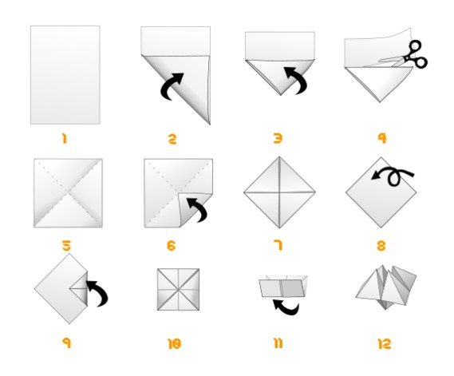

**Pôle Formation UIMM - CVDL**

---

# Atelier Cocotte LEAN — « L'Excellence par le Flux »

## Guide Complet de la Formation (1 Journée)

> [!IMPORTANT]
> **Objectif Global** : Permettre aux participants de découvrir les fondamentaux du LEAN à travers une simulation pratique de fabrication de cocottes en papier. La journée compare trois modes de production (flux poussé, flux tiré Kanban, optimisé Kaizen) pour démontrer l'impact sur le Lead Time, le WIP, la qualité et le bien-être.

<div style="page-break-before: always;"></div>

## 1. Informations Pratiques

| Paramètre | Valeur |
|:-----------|:-------|
| **Public cible** | Salariés d'entreprise (tous niveaux) |
| **Durée totale** | 7 h 30 (pause déjeuner incluse) |
| **Participants** | 8 à 16 personnes (idéalement 12) |
| **Organisation** | 2 lignes de production de 4 à 6 personnes |
| **Formateur(s)** | 1 à 2 coachs LEAN |

<div style="page-break-before: always;"></div>

## 2. Matériel Nécessaire

### Par participant

- 100 feuilles A4 blanches (80 g/m²)

### Par ligne de production

- 1 chronomètre
- 1 tableau d'indicateurs vierge (format A3)
- Des marqueurs de couleur

### Collectif

- 1 paperboard + feuilles vierges
- Post-its de couleurs (jaune, vert, rouge, bleu)
- Scotch, ciseaux, feutres
- Affiches des 8 gaspillages (format A3)
- Fiches d'Instruction au Poste (FIP) imprimées en A3
- Diagrammes Yamazumi vierges
- Cartes Kanban (rouge = occupé, verte = disponible) — 2 par poste
- Vidéoprojecteur + vidéo courte (ex. usine Toyota)

<div style="page-break-before: always;"></div>

## 3. Fiche d'Instruction Standard (FIP) — Fabrication de la Cocotte

> **Objectif** : Produire une cocotte symétrique, fonctionnelle et esthétique.
>
> **Matériel** : 1 feuille A4 blanche (80 g/m²).

### 3.1 Phase Préparatoire : Obtenir un Carré Parfait

> [!TIP]
> La majorité des rebuts en Round 1 viennent d'un carré mal coupé. Cette phase est critique.

1. **Le Triangle d'Or** : Prenez le coin supérieur gauche et rabattez-le sur le bord droit pour former un triangle rectangle isocèle.
2. **L'Élimination du Muda** : Découpez (ou déchirez proprement le long du pli) la bande rectangulaire restante.
3. **Résultat** : Vous obtenez un carré parfait de **210 × 210 mm**.

### 3.2 Étapes de Pliage

| Étape | Action | Points clés | Raison du point clé |
|:-----:|:-------|:------------|:---------------------|
| **1** | **Les Diagonales** | Marquer les deux plis en croix en repliant coin à coin. | Localiser précisément le centre. |
| **2** | **Le 1er Blintz** | Rabattre les 4 coins vers le point central. | Les bords ne doivent pas se chevaucher. |
| **3** | **Le Retournement** | Retourner la feuille, face lisse vers vous. | **Crucial** pour la cinématique d'ouverture. |
| **4** | **Le 2ème Blintz** | Rabattre les 4 nouveaux coins vers le centre. | Appuyer fort sur chaque pli (marquer). |
| **5** | **Le Pré-formage** | Plier le carré en deux (horizontal) puis en deux (vertical). | Bien marquer les plis extérieurs. |
| **6** | **L'Ouverture (Mise en volume)** | Glisser les doigts dans les 4 poches et pousser vers le centre. | Ne pas déchirer le papier. |

### 3.3 Schéma Visuel du Pliage



<div style="page-break-before: always;"></div>

## 4. Descriptif des 5 Postes de Travail

Chaque ligne de production est organisée en **5 postes séquentiels**. Chaque équipe nomme un **responsable d'équipe** et un **contrôleur qualité** (au Poste 5).

> [!TIP]
> **Adaptation au nombre de participants** : Le descriptif ci-dessous correspond à une configuration standard de 5 postes par ligne. En fonction du nombre de participants, le formateur doit adapter l'organisation :
>
> - **Moins de 8 participants** : Réduire à 3 ou 4 postes en fusionnant certaines opérations (ex. P2+P3 ou P4+P5).
> - **Plus de 12 participants** : Ajouter une 3ème ligne de production ou dédoubler certains postes (ex. 2 opérateurs au poste goulot).
> - L'essentiel est que chaque participant ait un rôle actif dans la ligne de production.

| Poste | Opérations | Temps indicatif |
|:-----:|:-----------|:---------------:|
| **P1** | Formation du carré (triangle, découpe, vérification 210 × 210 mm) | ~25 s |
| **P2** | Diagonales + 1er Blintz (4 coins au centre, face recto) | ~35 s |
| **P3** | Retournement + 2ème Blintz (4 coins au centre, face verso) | ~40 s |
| **P4** | Pré-formage (pli horizontal + pli vertical) | ~20 s |
| **P5** | Ouverture (mise en volume) + **Contrôle Qualité** | ~30 s |

> [!NOTE]
> Les temps indicatifs sont des moyennes observées. Le poste le plus lent (souvent P3) constitue le **goulot d'étranglement** qui limite le débit de toute la ligne.

<div style="page-break-before: always;"></div>

## 5. Critères de Contrôle Qualité

Pour être déclarée **« Conforme »**, chaque cocotte doit passer les 3 critères suivants :

| # | Critère | Description | Méthode de contrôle |
|:-:|:--------|:------------|:--------------------|
| 1 | **Symétrie** | Les 4 pointes doivent être de même hauteur | Poser la cocotte, vérifier visuellement l'alignement |
| 2 | **Mobilité** | S'ouvre et se ferme sans résistance (pas de plis « mous ») | Actionner 3 fois la cocotte dans les deux axes |
| 3 | **Propreté** | Absence de déchirures ou de traces de doigts excessives | Inspection visuelle |

**Cocotte non conforme** → Comptabilisée comme **défaut** dans les KPI. Elle n'est pas recomptée en production bonne.

<div style="page-break-before: always;"></div>

## 6. Calcul des Indicateurs (KPI)

### 6.1 Production Totale et Taux de Qualité

$$
\text{Production Totale} = \text{Nombre de cocottes terminées (bonnes + défectueuses)}
$$

$$
\text{Taux de Qualité} = \frac{\text{Cocottes conformes}}{\text{Cocottes terminées}} \times 100\%
$$

### 6.2 WIP (Work In Progress / En-cours)

Le WIP correspond au **nombre total de cocottes en cours de fabrication** à un instant donné — c'est-à-dire toutes les cocottes qui ont quitté le stock de matière première mais n'ont pas encore passé le contrôle qualité au Poste 5.

$$
\text{WIP} = \sum_{i=1}^{5} \text{En-cours au Poste}_i
$$

**Méthode de relevé** : À la fin du round, compter toutes les cocottes partiellement achevées entre les postes et aux postes.

### 6.3 Lead Time (Temps de traversée)

Le Lead Time est le **temps total** entre l'entrée d'une feuille au Poste 1 et la sortie de la cocotte terminée au Poste 5.

Deux méthodes de mesure :

**Méthode directe (chronométrage)** : Marquer une feuille (ex. croix au crayon) à son entrée, déclencher un chrono, l'arrêter quand la cocotte sort du P5.

**Méthode indirecte (Loi de Little)** :
$$
\text{Lead Time} = \frac{\text{WIP}}{\text{Débit}}
$$

### 6.4 Débit (Throughput)

Le débit est le **nombre de cocottes terminées par unité de temps**.

$$
\text{Débit} = \frac{\text{Cocottes terminées}}{\text{Durée du round (en minutes)}}
$$

**Exemple** : 52 cocottes terminées en 20 min → Débit = 2,6 cocottes/min.

### 6.5 Loi de Little

La **Loi de Little** relie les trois indicateurs fondamentaux d'un système en régime permanent :

$$
\boxed{\text{WIP} = \text{Débit} \times \text{Lead Time}}
$$

Ou de manière équivalente :

$$
\text{Lead Time} = \frac{\text{WIP}}{\text{Débit}}
$$

| Indicateur | Signification | Unité typique |
|:-----------|:--------------|:--------------|
| **WIP** | Nombre moyen de pièces dans le système | cocottes |
| **Débit** | Nombre de pièces terminées par unité de temps | cocottes/min |
| **Lead Time** | Temps de traversée moyen d'une pièce | min |

**Traduction opérationnelle** : Pour réduire le **Lead Time**, on peut soit **réduire le WIP**, soit **augmenter le Débit**.

**Exemple concret** :

- Round 1 : WIP = 50, Débit = 1 cocotte/min → Lead Time = 50/1 = **50 min**
- Round 2 : WIP = 5, Débit = 1 cocotte/min → Lead Time = 5/1 = **5 min** → ÷ 10 !

### 6.6 Takt Time

Le Takt Time est le **rythme de production imposé par la demande client**.

$$
\text{Takt Time} = \frac{\text{Temps disponible}}{\text{Demande client}}
$$

> [!IMPORTANT]
> **Calcul du Takt Time pour l'atelier :**
>
> | Donnée | Valeur |
> |:-------|:------:|
> | **Demande client** | **100 cocottes / heure** |
> | **Temps disponible** | **60 minutes** |
> | **Takt Time** | **60 min / 100 = 0,6 min = 36 secondes / cocotte** |
>
> ➡️ **Chaque poste doit réaliser son opération en 36 secondes maximum** pour satisfaire la demande client.

### 6.7 TRG (Taux de Rendement Global)

> [!NOTE]
> **TRG vs TRS** : Dans notre atelier, la **Disponibilité** se calcule par rapport au **Temps d'ouverture** (temps total de la session). C'est donc un **TRG** (Taux de Rendement Global) et non un TRS (Taux de Rendement Synthétique). Le TRS utiliserait le **Temps requis** (Temps d'ouverture − arrêts planifiés) au dénominateur.

$$
\boxed{\text{TRG} = \text{Disponibilité} \times \text{Performance} \times \text{Qualité}}
$$

| Composante | Formule | Exemple Round 3 |
|:-----------|:--------|:---------------:|
| **Disponibilité** | Temps effectif / Temps d'ouverture | 1150 s / 1200 s = **95,8 %** |
| **Performance** | Production réelle / Production théorique au Takt | min(68/33 , 1) = **100 %** |
| **Qualité** | Pièces bonnes / Pièces produites | 65/68 = **95,6 %** |
| **TRG** | Produit des trois | **91,5 %** ✅ |

**Repères** :

- TRG ≈ 40–50 % → production de masse désorganisée (typique Round 1)
- TRG ≈ 85 % → classe mondiale
- TRG > 90 % → excellence opérationnelle (objectif Round 3)

<div style="page-break-before: always;"></div>

## 7. Simulation 1 — Flux Poussé : « L'Usine à Stocks »

### 7.1 Règles du Round 1

> [!WARNING]
> **Mode production de masse**
>
> - Travail par **lots de 10 cocottes** : chaque poste doit terminer un lot complet de 10 pièces avant de le transférer au poste suivant. Par exemple, le P1 découpe et prépare 10 carrés, puis les pousse en bloc vers le P2. Le P2 attend d'avoir ses 10 pièces pliées avant de les envoyer au P3, etc.
> - Chaque poste produit **au maximum de sa capacité**, sans attendre le poste suivant
> - **Communication interdite** entre les postes
> - Objectif donné aux participants : « Produire le **maximum** en 20 minutes »

> [!NOTE]
> **Démarrage de la simulation** : Tous les postes démarrent **à vide** (aucun en-cours initial). Seul le **Poste 1** reçoit un stock de feuilles A4 brutes. Au signal « TOP Départ ! », le P1 commence immédiatement à travailler. Les postes suivants (P2 à P5) attendent de recevoir leur premier lot pour démarrer. C'est précisément cette montée en charge progressive qui génère les attentes et déséquilibres que l'on souhaite observer.

### 7.2 Déroulé

| Horaire | Activité | Durée |
|:--------|:---------|:-----:|
| 11 h 00 | Briefing : explication des règles, distribution du stock matière, installation des chronomètres | 5 min |
| 11 h 05 | **Production** — TOP Départ ! Le formateur observe sans intervenir. À mi-parcours (10 min), demander : « Qui est débordé ? Qui attend ? » | 20 min |
| 11 h 25 | **Comptage et mesures** — Arrêt de la production. Compter : cocottes terminées, en-cours par poste, défauts. | 10 min |
| 11 h 35 | **Débriefing approfondi** | 25 min |

### 7.3 Observations Attendues

- 📦 **En-cours massifs** entre les postes (stocks intermédiaires)
- 😰 **Stress visible** des opérateurs au goulot
- 🔴 **Défauts détectés tardivement** (au Poste 5, les cocottes du début sont déjà dans la pile)
- 🚧 **Goulot d'étranglement** (le poste le plus lent bloque tout le flux en aval)
- 🗑️ Présence de la plupart des **8 gaspillages** :
  - Surproduction (lots de 10)
  - Attentes (postes rapides inactifs)
  - Stocks (en-cours empilés)
  - Mouvements inutiles (chercher de la place)
  - Défauts (trouvés tard)
  - Sur-processus (retouches)

### 7.4 Questions de Débriefing

1. « Comment vous êtes-vous senti pendant la production ? »
2. « Qu'avez-vous observé ? »
3. « Où étaient les stocks ? »
4. « Quand avez-vous détecté les défauts ? »
5. Faire identifier les 8 gaspillages au paperboard

### 7.5 Relevé KPI — Round 1

| Indicateur | Valeur |
|:-----------|:------:|
| Production totale | ___ cocottes |
| En-cours (WIP) | ___ cocottes |
| Lead Time moyen | ___ s |
| Débit | ___ cocottes/min |
| Taux de qualité | ___ % |
| Stress perçu | ⭐⭐⭐⭐⭐ |

<div style="page-break-before: always;"></div>

## 8. Simulation 2 — Flux Tiré & Kanban : « L'Usine Fluide »

### 8.1 Concepts Clés

- **Flux Tiré (Pull)** : On ne produit que si le poste suivant (le « client ») le demande → inversion de la logique de production.
- **Kanban** : Signal visuel de déclenchement de production (carte verte = « je suis disponible, envoie une pièce »).
- **One Piece Flow** : Fabrication pièce par pièce (lot de 1) au lieu de lots de 10.

### 8.2 Règles du Round 2

> [!TIP]
> **Mode Flux Tiré**
>
> - Production **pièce à pièce** uniquement (lot = 1)
> - On ne produit que si le **poste aval** affiche sa **carte verte** (Kanban)
> - Carte **rouge** = poste occupé, ne pas envoyer
> - Carte **verte** = poste disponible, demande une pièce
> - **Communication autorisée** et encouragée
> - Objectif : **Réduire le Lead Time** et le WIP

### 8.3 Mise en Place du Kanban

1. Chaque poste reçoit **2 cartes Kanban** (1 rouge, 1 verte)
2. Le poste affiche la carte **verte** quand il est prêt à recevoir une pièce
3. Le poste amont ne transfert la pièce que s'il voit la carte verte
4. Dès réception, le poste passe en carte **rouge**
5. Réorganisation physique : **rapprocher les postes** pour minimiser les transports

### 8.4 Déroulé

| Horaire | Activité | Durée |
|:--------|:---------|:-----:|
| 13 h 00 | Briefing : explication flux tiré + démonstration Kanban au tableau | 15 min |
| 13 h 15 | Essai à blanc (5 cocottes test) | 5 min |
| 13 h 20 | **Production** — TOP Départ ! Observer : fluidité, communication, WIP, détection précoce des défauts. | 20 min |
| 13 h 40 | **Comptage et mesures** | 10 min |
| 13 h 50 | **Débriefing** + démonstration Loi de Little au tableau | 25 min |

### 8.5 Observations Attendues

- 📉 **WIP très faible** (1 à 2 pièces maximum dans le système)
- ⚡ **Lead Time considérablement réduit** (vérifiable par la Loi de Little)
- ✅ **Défauts détectés immédiatement** (poste suivant alerte le poste amont)
- 🤝 **Collaboration naturelle** entre les postes
- 😌 **Stress en baisse** significative

### 8.6 Questions de Débriefing

1. « Quelle différence majeure avec le Round 1 ? »
2. « Quand avez-vous détecté les défauts cette fois ? »
3. « Comment était votre niveau de stress ? »
4. « Quel rôle ont joué les cartes Kanban ? »

### 8.7 Relevé KPI — Round 2

| Indicateur | Valeur |
|:-----------|:------:|
| Production totale | ___ cocottes |
| En-cours (WIP) | ___ cocottes |
| Lead Time moyen | ___ s |
| Débit | ___ cocottes/min |
| Taux de qualité | ___ % |
| Stress perçu | ⭐⭐⭐ |

<div style="page-break-before: always;"></div>

## 9. Simulation 3 — Équilibrage & Kaizen

### 9.1 Objectifs

- Équilibrer les charges de travail entre postes
- Calculer et appliquer le Takt Time
- Mettre en place le 5S
- Pratiquer l'amélioration continue (Kaizen)

### 9.2 Atelier Yamazumi (Diagramme d'Équilibrage)

1. **Chronométrer** chaque poste individuellement : pour chaque poste (P1 à P5), mesurer le temps de cycle de son opération spécifique sur **3 cycles consécutifs**, puis calculer la **moyenne**. Par exemple, chronométrer 3 fois l'opération du P3 (retournement + 2ème Blintz) et faire la moyenne des 3 mesures pour obtenir le temps de cycle moyen du P3.
2. **Construire** le diagramme Yamazumi au paperboard :
   - Axe vertical : Temps (secondes)
   - Axe horizontal : Postes P1 à P5
   - Ligne horizontale : **Takt Time cible** (ex. 36 s)

```
Temps (sec)
   60│         █████
   50│  ████   █████  ████
   40│  ████   █████  ████  ████
   30│  ████ ┆ █████  ████  ████  ████  ← Takt Time = 36 s
   20│  ████   █████  ████  ████  ████
   10│  ████   █████  ████  ████  ████
    0└─────┬────┬────┬────┬────┬────
         P1   P2   P3   P4   P5
```

1. **Identifier le goulot** (poste au-dessus du Takt Time)
2. **Brainstorming** en équipe pour réduire ce temps :
   - Redistribuer certaines opérations
   - Simplifier les gestes
   - Améliorer l'ergonomie

### 9.3 Mise en Place du 5S

| # | Japonais | Signification | Action concrète |
|:-:|:---------|:--------------|:----------------|
| 1 | **Seiri** | Trier | Retirer le matériel inutile des tables |
| 2 | **Seiton** | Ranger | Placer chaque outil à portée de main (zone de préhension) |
| 3 | **Seiso** | Nettoyer | Remettre les tables en ordre |
| 4 | **Seiketsu** | Standardiser | Photographier la disposition (standard visuel) |
| 5 | **Shitsuke** | Respecter | S'engager collectivement à maintenir l'organisation |

### 9.4 Production Round 3 (20 min)

- Application des améliorations (nouveau layout, tâches rééquilibrées, 5S)
- Objectif : qualité maximale + respect du Takt Time

### 9.5 Relevé KPI — Round 3

| Indicateur | Valeur |
|:-----------|:------:|
| Production totale | ___ cocottes |
| En-cours (WIP) | ___ cocottes |
| Lead Time moyen | ___ s |
| Débit | ___ cocottes/min |
| Taux de qualité | ___ % |
| Stress perçu | ⭐⭐ |

<div style="page-break-before: always;"></div>

## 10. Tableau Comparatif des 3 Rounds

| Indicateur | Round 1 — Flux Poussé | Round 2 — Kanban / Flux Tiré | Round 3 — Optimisé Kaizen |
|:-----------|:---------------------:|:----------------------------:|:-------------------------:|
| **Production totale** | ~45 | ~52 | ~68 |
| **En-cours (WIP)** | ~48 (montagnes) | ~8 (limité) | ~2 (minimal) |
| **Lead Time moyen** | ~18 min | ~5 min | ~2 min |
| **Débit** | ~2,3 cocottes/min | ~2,6 cocottes/min | ~3,4 cocottes/min |
| **Taux de qualité** | ~62 % | ~85 % | ~96 % |
| **TRG estimé** | ~45 % | ~75 % | ~91 % |
| **Stress perçu** | ⭐⭐⭐⭐⭐ (Maximum) | ⭐⭐⭐ (En baisse) | ⭐⭐ (Serein) |
| **Collaboration** | Faible | Moyenne | Excellente |

*Les chiffres ci-dessus sont des exemples types observés lors de formations précédentes.*

<div style="page-break-before: always;"></div>

## 11. Déroulé Chronologique de la Journée

| Horaire | Phase | Durée |
|:--------|:------|:-----:|
| 09 h 00 – 09 h 30 | Accueil & Brise-glace « La Cocotte Agile » | 30 min |
| 09 h 30 – 10 h 15 | Fondamentaux du LEAN (Muda, Muri, Mura, 8 gaspillages) | 45 min |
| 10 h 15 – 10 h 45 | Standardisation : FIP + Organisation des 5 postes | 30 min |
| 10 h 45 – 11 h 00 | ☕ Pause | 15 min |
| 11 h 00 – 12 h 00 | **Round 1 : Flux Poussé** (production + débriefing) | 1 h 00 |
| 12 h 00 – 13 h 00 | 🍽️ Pause déjeuner | 1 h 00 |
| 13 h 00 – 14 h 15 | **Round 2 : Flux Tiré Kanban** (production + débriefing) | 1 h 15 |
| 14 h 15 – 15 h 45 | **Round 3 : Équilibrage & Kaizen** (Yamazumi, 5S, production) | 1 h 30 |
| 15 h 45 – 16 h 00 | ☕ Pause | 15 min |
| 16 h 00 – 16 h 45 | Synthèse finale : tableau comparatif + calcul du TRG | 45 min |
| 16 h 45 – 17 h 00 | Clôture & Plan d'action personnel | 15 min |

<div style="page-break-before: always;"></div>

## 12. Annexes pour le Formateur

### 12.1 Checklist Pré-Formation

- [ ] Imprimer la Fiche d'Instruction au Poste (FIP) en A3 (1 par poste)
- [ ] Imprimer les affiches des 8 gaspillages
- [ ] Préparer les cartes Kanban (vertes et rouges, 2 par poste)
- [ ] Tester le pliage cocotte en amont (vérifier la qualité du papier 80 g/m²)
- [ ] Préparer les chronomètres et tableaux de bord vierges
- [ ] Commander post-its, marqueurs, scotch, feutres
- [ ] Vérifier la salle : tables mobiles pour réorganisation entre les rounds
- [ ] Prévoir vidéoprojecteur + vidéo Toyota (3-4 min)
- [ ] Préparer les badges nominatifs et kits matériel individuels
- [ ] Imprimer le diagramme Yamazumi vierge en A3

### 12.2 Grille d'Observation des Comportements

| Dimension | Round 1 (Poussé) | Round 2 (Kanban) | Round 3 (Kaizen) |
|:----------|:-----------------|:-----------------|:-----------------|
| Communication | Individualisme, silence | Début de communication | Échanges fluides |
| Ambiance | Frustration, recherche de coupables | Entraide ponctuelle | Esprit d'équipe |
| Face aux défauts | Ignorés ou cachés | Signalés au poste amont | Problème = opportunité |
| Posture | Stress, crispation | Relâchement progressif | Sourires, sérénité |

### 12.3 Variantes Pédagogiques

**Pour un public confirmé :**

- Ajouter un Round 4 avec introduction du **Heijunka** (lissage de production) : demande client variable (3 types de cocottes de tailles différentes)
- Simuler des **pannes machine** ou des variations de demande client pendant le round

**Pour un public débutant :**

- Simplifier le calcul du TRG (omettre la composante Performance)
- Se concentrer sur Round 1 vs Round 2 uniquement
- Insister sur l'expérience vécue plutôt que sur les formules

**Pour un format demi-journée :**

- Supprimer le Round 3 (Kaizen)
- Synthèse directe après le Round 2
- Durée : environ 3 h 30

### 12.4 Conseils Pédagogiques

> [!TIP]
> **Standard au poste** : Imprimez la FIP et scotchez-la directement sur la table. Lors du Round 1, personne ne la regarde ! C'est lors du débriefing que vous direz : *« Le standard était sous vos yeux, pourquoi ne l'avez-vous pas suivi ? »* — meilleur moyen d'introduire la **discipline opérationnelle**.

> [!NOTE]
> **Message clé de la journée** : Le LEAN n'est pas une méthode pour travailler plus vite, mais pour **travailler mieux en supprimant ce qui ne sert à rien**.
>
> Citation de Taiichi Ohno : *« Le pire gaspillage, c'est de faire efficacement quelque chose qui ne devrait pas être fait du tout. »*

<div style="page-break-before: always;"></div>

## 13. Indicateurs de Réussite de la Formation

À l'issue de la journée, les participants doivent être capables de :

1. ✅ Citer les 3 démons du LEAN (Muda, Muri, Mura)
2. ✅ Identifier au moins 5 des 8 gaspillages dans leur environnement
3. ✅ Expliquer la différence entre flux poussé et flux tiré
4. ✅ Comprendre l'impact du WIP sur le Lead Time (Loi de Little)
5. ✅ Calculer un TRG à partir des 3 composantes
6. ✅ Proposer au moins une amélioration concrète (Kaizen) pour leur poste
7. ✅ Comprendre que le LEAN est avant tout un **état d'esprit**

---

*Document unifié — Version 1.0 — Février 2026*
