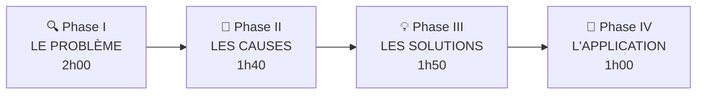

# 🎯 Puissance 7® — Guide de l'Animateur

> **Jeu d'entreprise conçu par le CIPE** (Centre International de la Pédagogie d'Entreprise)
> Auteur : Henri Mitonneau — Licence CFAI Centre Val de Loire Orléans

---

## 1. Présentation générale

**Puissance 7®** est un jeu d'entreprise interactif sous forme d'étude de cas. Les participants jouent le rôle d'un groupe de travail chargé de résoudre un problème réel dans une entreprise fictive de logistique : **DISTRIMAX**.

Le jeu enseigne **une méthode structurée de résolution de problème en 14 étapes** et l'utilisation des **7 outils de la qualité**, le tout dans une démarche collaborative et ludique, comparable à une enquête policière.

### Public et format

| Paramètre | Détail |
|---|---|
| **Public** | Techniciens, maîtrise, étudiants |
| **Effectif** | 6 à 24 participants |
| **Équipes** | Jusqu'à 4 équipes (extensible avec kit complémentaire) |
| **Durée totale** | ~7h10 (fractionnable en plusieurs séances) |

### Objectifs pédagogiques

À l'issue de la formation, le participant sera capable de :

- Suivre les phases et étapes de la méthode de résolution de problème
- Appliquer les **7 outils de la qualité** : QQOQCP, Feuille de Relevés, Graphique & Pareto, Diagramme Causes-Effet, 5 Pourquoi, Brainstorming, Matrice
- Travailler efficacement en groupe
- Comprendre la nécessité d'un système qualité et de procédures d'assurance qualité

---

## 2. La méthode : 4 phases, 14 étapes

Le cœur du jeu repose sur une **méthode de résolution de problème en 14 étapes**, réparties en 4 phases :



### Tableau détaillé des étapes

| Phase | Étape | Intitulé | Outil principal | Durée indicative |
|---|---|---|---|---|
| **I — Le Problème** | 1 | Définir la situation de départ | QQOQCP | ~20 min |
| | 2 | Quantifier la situation actuelle | Feuille de Relevés + Graphique | ~30 min |
| | 3 | Déterminer l'aspect important | Pareto | ~30 min |
| | 4 | Définir l'objectif à atteindre | QQOQCP | ~25 min |
| **II — Les Causes** | 5 | Énoncer toutes les causes possibles | Brainstorming | ~20 min |
| | 6 | Analyser les causes | Diagramme Causes-Effet (Ishikawa) | ~25 min |
| | 7 | Vérifier les causes | Matrice + 5 Pourquoi | ~40 min |
| **III — Les Solutions** | 8 | Rechercher toutes les solutions | Brainstorming | ~25 min |
| | 9 | Définir les critères d'évaluation | Matrice (vote pondéré) | ~20 min |
| | 10 | Décider les solutions à appliquer | Matrice (vote pondéré) | ~20 min |
| | 11 | Valider les solutions | QQOQCP | ~20 min |
| **IV — L'Application** | 12 | Impliquer les personnels | Matrice (plan d'action) | ~15 min |
| | 13 | Suivre la réalisation | Feuille de Relevés + Graphique | ~20 min |
| | 14 | Standardiser et reboucler | QQOQCP | ~15 min |

---

## 3. Le scénario : l'entreprise DISTRIMAX

### Contexte

**DISTRIMAX** est une entreprise de distribution de colis en Seine-et-Marne. Elle dispose de plusieurs tournées de livraison (T5, T9, T12, T15) et rencontre un problème croissant d'**anomalies de livraison** signalées par les clients.

### Le problème

Sur les 8 dernières semaines, **61 anomalies de livraison** ont été recensées, de 5 types :

| Code | Type d'anomalie | Nombre | Coeff. pondération |
|---|---|---|---|
| A | Colis non livré — client fermé au passage | 36 (59%) | 2,5 |
| B | Colis affecté par erreur à la tournée | 6 (9%) | 3 |
| C | Fiche colis manquante | 7 (12%) | 3 |
| D | Véhicule plein | 7 (12%) | 1 |
| E | Adresse inconnue | 5 (8%) | 2,5 |

> **Conclusion clé** : La tournée 12 concentre **53% des cas** de « clients fermés au passage », qui représentent eux-mêmes **60% des coûts** de traitement des anomalies.

### La cause racine

Le **changement du plan de circulation à Meaux** (marché) contraint le chauffeur (M. George) de la tournée 12 à prendre du retard, arrivant après la fermeture chez Carrefour Claye-Souilly et Renaud Villeparisis.

**Causes profondes** (révélées par les 5 Pourquoi) :

- Manque de communication chauffeur / administration
- Absence de procédure de traitement des réclamations
- Absence de système qualité chez DISTRIMAX

### Les solutions attendues

**Corrective** : S1 — Nouveau plan pour la tournée 12 (inversion de l'itinéraire)

**Préventives** :

- S2 — Renforcer la procédure d'échange des documents départ/retour
- S3 — Créer un système de traitement des réclamations clients
- S4 — Démarrer des groupes de résolution de problèmes
- S5 — Implanter un système de suggestions
- S6 — Mesurer des indicateurs de performance
- S7 — Mieux communiquer les messages de la Direction

---

## 4. Plan d'animation détaillé

### Vue d'ensemble du timing

| Séquence | Durée |
|---|---|
| Introduction | 0h30 |
| Phase I — Le Problème | 2h00 |
| Phase II — Les Causes | 1h40 |
| Phase III — Les Solutions | 1h50 |
| Phase IV — L'Application | 1h00 |
| Synthèse méthodologique | 0h10 |
| **Total** | **7h10** |

### Rythme d'animation

> **À chaque étape, suivre systématiquement le même rythme en 4 temps** :
>
> 1. 🟡 **Quelle est la situation ?** — Présenter le contexte de l'étape
> 2. 🎯 **Quel est l'objectif ?** — Expliquer ce qu'on cherche à obtenir
> 3. 🔧 **Quel outil utiliser ?** — Les participants identifient l'outil, puis le mettent en pratique
> 4. ✅ **Bilan après utilisation** — Tour de table, correction, échanges

---

### INTRODUCTION (30 min)

1. **Présentation de la problématique** (10 min)
   - Les défauts existent → il faut les rendre apparents
   - Vouloir le progrès = renoncer à s'accommoder des perturbations
   - Une méthode structurée est nécessaire

2. **Projection de la vidéo DISTRIMAX** (4 min)
   - Fichier : `Clé USB Puissance 7/Animation/Vidéo de présentation DISTRIMAX/00. Présentation DISTRIMAX HD.mp4`

3. **Distribution du matériel** (5 min)
   - Distribuer la **fiche A3 « Le Cas DISTRIMAX »** à chaque équipe
   - Distribuer le **Dossier Pédagogique A4** (recto-verso) à chaque participant

4. **Présentation de la méthodologie** (10 min)
   - Présenter les 4 phases et 14 étapes
   - Présenter les 7 outils
   - Expliquer le rythme en 4 temps de chaque étape

---

### PHASE I — LE PROBLÈME (2h00)

#### Étape 1 : Définir la situation de départ

| Aspect | Détail |
|---|---|
| **Situation** | Informations initiales peu nombreuses, perçues différemment par chacun |
| **Objectif** | Définir précisément ce que l'on sait |
| **Outil** | QQOQCP |
| **Action animateur** | Distribuer une feuille QQOQCP par équipe |
| **Temps de travail** | 10 min |

**Après l'exercice — Réponses attendues :**

- **Qui ?** Les revendeurs, chauffeurs, chef de quai, Direction Commerciale 77, service préparation, groupe PERFORMANCE, Direction Générale
- **Quoi ?** Réclamations clients, anomalies de livraison
- **Où ?** Tournées Seine-et-Marne
- **Quand ?** Durant les 8 dernières semaines
- **Comment ?** Détecté par les bordereaux de livraison rendus par les chauffeurs
- **Pourquoi ?** Responsabilité de trouver une solution dans le cadre de la politique d'amélioration service client

#### Étape 2 : Quantifier la situation actuelle

| Aspect | Détail |
|---|---|
| **Situation** | Distrimax dispose d'informations brutes |
| **Objectif** | Ordonner les informations pour avoir une quantification chiffrée |
| **Outil** | Feuille de Relevés + Graphique |
| **Action animateur** | Distribuer les **Fiches Information n°1** (31 cartes) + feuille « Relevé » |
| **Temps de travail** | 5 min d'analyse des cartes + 10 min de remplissage |

**Déroulement :**

1. Les équipes analysent les 31 cartes d'information (5 min)
2. Tour de table sur le ressenti initial
3. Distribution de la feuille « Relevé » → remplissage (10 min)
4. Tour de table et échanges autour de la feuille remplie
5. Distribution de la feuille « Graphique » + feutres → construire un graphique sur « Client fermé au passage » (5 min)

#### Étape 3 : Déterminer l'aspect important

| Aspect | Détail |
|---|---|
| **Situation** | Plusieurs types d'anomalies avec des gravités différentes |
| **Objectif** | Décider de l'aspect le plus important pour concentrer l'énergie |
| **Outil** | Pareto |
| **Action animateur** | Distribuer une feuille « Pareto » |
| **Temps de travail** | 10 min |

**Après l'exercice :**

- Distribuer la **Fiche Information n°2** (coûts de traitement des anomalies)
- Montrer l'impact de la pondération par les coûts
- Conclusion : « Client fermé au passage » = 59% des cas et 60% des coûts

#### Étape 4 : Définir l'objectif à atteindre

| Aspect | Détail |
|---|---|
| **Situation** | Anomalies identifiées, coûts et distribution par tournée connus |
| **Objectif** | Décider d'un objectif quantifié |
| **Outil** | QQOQCP |
| **Action animateur** | Distribuer une feuille QQOQCP |
| **Temps de travail** | 10 min |

**Réponses attendues :**

- Priorité : « clients fermés au passage » sur la tournée 12 (53% des cas)
- Objectif : ramener la T12 au niveau des autres tournées (~6 anomalies sur 8 semaines)
- Réduction globale de 50% des incidents en 3 mois

> ⚠️ **Restitution de fin de Phase I** : Chaque groupe présente son travail (situation, objectif, outil choisi, résultat obtenu, difficultés). Prévoir ~15 min.

---

### PHASE II — LES CAUSES (1h40)

#### Étape 5 : Énoncer toutes les causes possibles

| Aspect | Détail |
|---|---|
| **Situation** | Anomalies identifiées mais aucune donnée objective sur leurs causes |
| **Objectif** | Imaginer TOUTES les causes possibles (sans censure) |
| **Outil** | Brainstorming (post-it) |
| **Action animateur** | Distribuer post-it + stylos |
| **Temps de travail** | 10 min en silence, chacun rédige ses post-it |

> **Point d'attention** : Pas de correction à ce stade ! Laisser s'exprimer la créativité.

#### Étape 6 : Analyser les causes

| Aspect | Détail |
|---|---|
| **Situation** | Liste large de causes possibles, pas de consensus |
| **Objectif** | Classer les causes par familles (5M) pour faciliter l'analyse |
| **Outil** | Diagramme Causes-Effet (Ishikawa) |
| **Action animateur** | Distribuer une feuille « Diagramme causes-effet » |
| **Temps de travail** | 15 min |

**Causes attendues classées en 5M :**

| Famille | Causes identifiées |
|---|---|
| **Matière** | Fiche colis difficilement exploitable, bordereaux non exploitables, colis perdus, adresse illisible |
| **Machine** | Véhicules en mauvais état, véhicules sous-dimensionnés, ordinateur défaillant |
| **Milieu** | Difficultés de circulation, limitations de vitesse, horaires non respectés par clients, accès difficiles |
| **Méthode** | Trop de papiers, manque de fiabilité documents, mauvaise conception tournées, mauvaise organisation quai, manque de communication, absence de traitement des réclamations |
| **Main d'œuvre** | Chauffeurs mal informés, problème personnel chauffeur, manque de conscience pro, qualification insuffisante |

#### Étape 7 : Vérifier les causes

| Aspect | Détail |
|---|---|
| **Situation** | Fortes présomptions sur certaines causes |
| **Objectif** | Vérifier les hypothèses avec des faits (attitude scientifique) |
| **Outil** | Matrice (sans influence / influence directe / influence indirecte) |
| **Action animateur** | Distribuer une feuille « Matrice ». Les équipes posent des questions → l'animateur fournit les fiches d'information correspondantes |
| **Temps de travail** | 20 min |

**Résultat attendu :**

- **Cause directe** : Difficultés de circulation à Meaux (i/)
- **Causes indirectes** : Communication chauffeurs/service (q/), procédure réclamations (r/), conscience professionnelle (v/)
- Toutes les autres causes : SANS influence

**Puis : les 5 Pourquoi** (20 min)

L'animateur introduit l'outil « 5 Pourquoi » à 3 niveaux :

1. **Pourquoi a-t-on eu ce problème ?** (Correction)
   - Colis non livrés → clients fermés → camion en retard → difficultés de circulation → déviation → marché à Meaux

2. **Pourquoi le problème n'a pas été détecté ?** (Détection)
   - Bons émargés ne reviennent pas → chauffeurs ne les donnent pas → pas formés → pas de plan de formation → pas de système qualité

3. **Pourquoi le système n'a pas prévenu le problème ?** (Prévention)
   - Problèmes de circulation pas connus → trajets pas analysés → pas souhaité → coûts énormes

> ⚠️ **Restitution de fin de Phase II** : Chaque groupe présente ses travaux sur les causes. Prévoir ~15 min.

---

### PHASE III — LES SOLUTIONS (1h50)

#### Étape 8 : Rechercher toutes les solutions possibles

| Aspect | Détail |
|---|---|
| **Situation** | Causes directes et profondes identifiées |
| **Objectif** | Rechercher le maximum de solutions (correctives ET préventives) |
| **Outil** | Brainstorming (post-it) |
| **Action animateur** | Distribuer post-it |
| **Temps de travail** | 10 min en silence + 10 min d'échanges en équipe |

#### Étape 9 : Définir les critères d'évaluation des solutions

| Aspect | Détail |
|---|---|
| **Situation** | Solutions listées, mais chacun a ses préférences |
| **Objectif** | S'accorder sur les critères AVANT de choisir (approche « à froid ») |
| **Outil** | Matrice (vote pondéré sur les critères) |
| **Action animateur** | Distribuer la **Fiche Information n°8** + feuille « Matrice » |
| **Temps de travail** | 15 min |

**Critères attendus :**

| Code | Critère |
|---|---|
| C1 | Facilité / simplicité de la solution |
| C2 | Efficacité de la solution (par rapport aux objectifs initiaux) |
| C3 | Économie de la solution (peu coûteuse) |
| C4 | Rapidité de mise en œuvre de la solution |
| C5 | Contribution à la lettre du management |

> **Notation** : Chaque participant vote 0 (pas important), 1 (important) ou 2 (très important) pour chaque critère.

#### Étape 10 : Décider les solutions à appliquer

| Aspect | Détail |
|---|---|
| **Situation** | Critères définis, démarche rationnelle et dépassionnée |
| **Objectif** | Décider des solutions à retenir |
| **Outil** | Matrice (vote pondéré sur les solutions) |
| **Action animateur** | Distribuer une feuille « Matrice » |
| **Temps de travail** | 15 min |

> **Notation** : Chaque participant vote 1, 2 ou 3 pour chaque solution × critère. On pondère par le poids de chaque critère.

#### Étape 11 : Valider les solutions

| Aspect | Détail |
|---|---|
| **Situation** | Solutions arrêtées, mais engagement de ressources nécessaire |
| **Objectif** | Faire valider par le management (simulation) |
| **Outil** | QQOQCP |
| **Action animateur** | Distribuer une feuille QQOQCP |
| **Temps de travail** | 10 min |

> ⚠️ **Restitution de fin de Phase III** : Échanges sur les différentes voies choisies par les groupes. ~10 min.

---

### PHASE IV — L'APPLICATION (1h00)

#### Étape 12 : Impliquer les personnels

| Aspect | Détail |
|---|---|
| **Situation** | Solutions validées par le management |
| **Objectif** | Distribuer les rôles (qui fait quoi, quand) |
| **Outil** | Matrice (plan d'action) |
| **Action animateur** | Distribuer la **Fiche Information n°9** + feuille « Matrice » |
| **Temps de travail** | 10 min |

#### Étape 13 : Suivre la réalisation

| Aspect | Détail |
|---|---|
| **Situation** | Actions définies, affectées et planifiées |
| **Objectif** | Vérifier que le problème est effectivement résolu |
| **Outil** | Feuille de Relevés + Graphique |
| **Action animateur** | Distribuer les **Fiches Information n°10** (25 cartes) + feuille « Relevés » |
| **Temps de travail** | 10 min |

#### Étape 14 : Standardiser et reboucler

| Aspect | Détail |
|---|---|
| **Situation** | Problème résolu sur la tournée 12 |
| **Objectif** | Étendre la solution aux autres tournées et standardiser |
| **Outil** | QQOQCP |
| **Action animateur** | Distribuer une feuille QQOQCP |
| **Temps de travail** | 10 min |

---

### SYNTHÈSE (10 min)

Récapituler avec les participants ce qu'ils ont appris :

- Rechercher les informations pour résoudre un problème
- Présenter les données pour qu'elles aient la même signification pour tous
- Développer leur créativité
- Établir rationnellement des hypothèses et les évaluer objectivement
- Construire des solutions en groupe
- Mettre en œuvre et suivre l'application

---

## 5. Matériel nécessaire

### Documents à distribuer (Consommables)

| Document | Format | Quantité par équipe | Étapes concernées |
|---|---|---|---|
| Fiche « Le Cas DISTRIMAX » | A3 | 1 | Introduction |
| Dossier Pédagogique | A4 recto-verso | 1 par participant | Toute la formation |
| Feuilles QQOQCP | A4 | 4 | Étapes 1, 4, 11, 14 |
| Feuilles de Relevés | A4 | 2 | Étapes 2, 13 |
| Feuille Graphique | A4 | 2 | Étapes 2, 13 |
| Feuille Pareto | A4 | 1 | Étape 3 |
| Feuille Diagramme Causes-Effet | A4 | 1 | Étape 6 |
| Feuilles Matrice | A4 | 4 | Étapes 7, 9, 10, 12 |
| Feuille 5 Pourquoi | A4 | 1 | Étape 7 |

### Fiches d'information (à distribuer au moment opportun)

| Fiche | Contenu | Étape |
|---|---|---|
| FI n°1 | 31 cartes d'anomalies de livraison | Étape 2 |
| FI n°2 | Coûts de traitement des anomalies | Étape 3 |
| FI n°3 à n°7 | Informations pour vérification des causes | Étape 7 |
| FI n°8 | Lettre du management (critères) | Étape 9 |
| FI n°9 | Contexte organisationnel (plan d'action) | Étape 12 |
| FI n°10 | 25 cartes de suivi post-solution | Étape 13 |

### Autres fournitures

- Post-it (en grande quantité)
- Stylos et feutres de couleurs
- Vidéoprojecteur (pour la vidéo et les slides de correction)
- Pochettes de feutres pour les graphiques

---

## 6. Conseils à l'animateur

### Posture générale

- **Ne jamais donner la réponse directement** : guider les participants vers la bonne réflexion
- **Respecter le rythme en 4 temps** à chaque étape : c'est le fil conducteur
- **Favoriser le débat** lors des tours de table : les désaccords sont normaux et constructifs
- **Valoriser le travail en groupe** plutôt que les performances individuelles

### Points de vigilance par phase

| Phase | Attention particulière |
|---|---|
| **Phase I** | Ne pas aller trop vite sur le QQOQCP initial. Les participants ont tendance à vouloir sauter aux solutions → les ramener à la rigueur de la méthode |
| **Phase II** | Le brainstorming doit être **silencieux** (post-it individuels d'abord). Insister sur l'absence de censure. Ne pas corriger les causes à l'étape 5 ! |
| **Phase III** | Les critères d'évaluation (étape 9) doivent être définis **AVANT** de voter sur les solutions (étape 10) — c'est le principe « à froid » |
| **Phase IV** | Faire le lien entre le plan d'action DISTRIMAX et les situations réelles des participants |

### Gestion des fiches d'information

> **Important** : À l'étape 7 (vérifier les causes), les fiches ne sont **pas distribuées spontanément**. Les équipes doivent formuler des **questions précises** et l'animateur leur fournit la fiche correspondante. Cela simule une démarche d'investigation active.

### Quiz de validation (optionnel)

Un questionnaire d'évaluation de 10 questions est disponible (`Feuilles Quiz de validation des acquis`). Il peut être distribué en fin de formation pour vérifier la compréhension des concepts clés :

- Nombre de phases de la résolution de problème
- Signification de QQOQCP
- Autre nom du diagramme de Pareto
- Objectif de l'outil « 5 Pourquoi »
- Etc.

### Dossier de restitution (optionnel)

L'animateur peut demander un travail de restitution post-formation (ex : 2 semaines après) couvrant :

1. Description synthétique de la méthode et ses étapes
2. Explication de l'utilité de chacun des 7 outils
3. Quel outil est le plus difficile à utiliser, et pourquoi ?
4. Précautions pour pallier ces difficultés
5. Préparation d'une présentation au management (le plus complexe)

> Ce dossier permet d'attribuer une **note par équipe** évaluant le niveau de compréhension.

---

## 7. Les 7 outils — Aide-mémoire

| Outil | Fonction | Utilisé aux étapes |
|---|---|---|
| **QQOQCP** | Décrire une situation de façon précise | 1, 4, 11, 14 |
| **Feuille de Relevés** | Enregistrer des données de façon structurée | 2, 13 |
| **Graphique & Pareto** | Représenter visuellement les données et classer par importance | 2, 3, 13 |
| **Diagramme Causes-Effet** | Identifier et classer les causes possibles d'un effet (5M) | 6 |
| **5 Pourquoi** | Trouver les causes racines à 3 niveaux (correction, détection, prévention) | 7 |
| **Brainstorming** | Chercher des idées en groupe sans censure | 5, 8 |
| **Matrice** | Classer des solutions selon des critères, vote pondéré, plan d'action | 7, 9, 10, 12 |

---

## 8. Fichiers de la clé USB

```
Clé USB Puissance 7/
├── Animation/
│   ├── Guide d'animation PUISSANCE 7.pptx    ← Slides de présentation (animateur)
│   └── Vidéo de présentation DISTRIMAX/
│       └── 00. Présentation DISTRIMAX HD.mp4  ← Vidéo d'introduction (3'50)
└── Consommables/
    ├── Dossier Pédagogique A4 RectoVerso.pptx ← Livret participant (à imprimer)
    ├── Feuilles A3 Recto papier 1ex.pptx      ← Fiche « Le Cas DISTRIMAX »
    ├── Feuilles Corrigés A4.pptx              ← Corrigés pour l'animateur
    └── Feuilles Quiz de validation.pptx       ← Quiz final (optionnel)
```

> **Droit de reproduction** : La licence inclut le droit de reproduction des consommables pour un usage illimité en formation initiale et apprentissage à l'établissement de La Chapelle Saint Mesmin.

---

*Document rédigé pour l'animation par S. Jaubert — CFAI Centre Val de Loire*
*Source : Puissance 7®, CIPE — <www.cipe.fr>*
