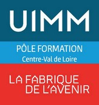

# PLAN DE FORMATION : Organisation Industrielle

## Trajectoire Industrie E18 Bourges, journée 1 sur 4

**Pôle Formation UIMM CVDL**  
*S. Jaubert*

---

## Informations générales

- **Date** : jeudi 8 octobre 2026
- **Durée** : 1 jour (7 h), 9 h 00 à 12 h 30 et 13 h 30 à 17 h 00
- **Lieu** : Bourges
- **Public** : 12 demandeurs d'emploi en parcours métier PRF, trois filières
- **Formateur** : S. Jaubert
- **Suite du parcours** : 11, 17 et 18 décembre 2026

| Filière | Effectif | Stagiaires |
|:--------|:--------:|:-----------|
| Chaudronnerie | 5 | BIRAIS, BLONDY, LOJOWSKI, MANCHET, TUR-JOUANNEAU |
| **ORMOCN** (opérateur régleur sur machine-outil à commande numérique) | 3 | CREUZE, DESLIERS, GATEAU |
| **TMI** (technicien de maintenance industrielle) | 4 | KHEUM, PETIT, VANG, VIDALIE |

Trois stagiaires ont une entreprise renseignée : INVEHO UFO (BIRAIS), L'Atelier de Bourrellerie (DESLIERS), SYNERGIE (GATEAU).

**Philosophie de la journée** : partir de ce que les stagiaires savent déjà du travail, les faire parler et débattre, puis mettre des mots sur ce qu'ils ont dit. Les apports du formateur arrivent après la discussion, jamais avant.

---

## Objectifs de la journée

À l'issue de la journée, les participants seront capables de :

- Décrire une entreprise industrielle par ce qu'elle produit, pour qui et en quelle quantité.
- Situer un métier (chaudronnier, régleur CN, technicien de maintenance) dans le flux de production.
- Distinguer les grandes familles d'industrie et les **typologies de production** (unitaire, série, continu).
- Reconnaître les 8 **gaspillages** (**Mudas**) dans une situation de travail concrète.

---

## Programme détaillé

> [!IMPORTANT]
> **Note pour l'animation** : les durées sont indicatives. Si le débat du matin prend, on le laisse vivre et on raccourcit la séquence tampon de l'après-midi. Vocabulaire atelier en priorité. Le jargon japonais est limité à Muda, Kaizen, 5S.

---

### MATIN : Qui produit quoi ? (3 h 30)

**1. Accueil et cadre (9 h 00, 20 min)**

- Présentation du formateur, du déroulé de la journée et des quatre journées du parcours.
- Trois règles du débat, écrites au tableau : on parle d'un exemple vécu, on critique une idée et pas une personne, personne n'a « la » bonne réponse.

**2. Interview croisée en binômes (9 h 20, 75 min)**

*Objectif* : faire parler chacun sans l'exposer, et produire la matière de toute la journée.

- Binômes mixtes entre filières : un chaudronnier avec un TMI, un ORMOCN avec un chaudronnier, etc.
- Consigne élargie : « une entreprise que tu connais de l'intérieur ». Ancien emploi, stage, entreprise visée : tout est accepté.
- Chacun interroge l'autre pendant 7 min avec la grille ci-dessous, puis présente son binôme au groupe en 3 min.

| Question de la grille | Ce qu'elle prépare |
|:----------------------|:-------------------|
| Qu'est-ce qui sort de la porte de l'entreprise, et pour qui ? | Notion de client et de valeur |
| Combien : 1 pièce, 10, 10 000 ? | Typologies de production |
| Qui te dit ce que tu fais à 8 h ? | Planification, rôle de l'encadrement |
| Qu'est-ce qui arrête la production chez vous ? | Gaspillages, pannes, attentes |

- Pendant les présentations, le formateur place chaque entreprise au tableau sur deux axes : quantité produite (de l'unitaire à la grande série) et famille d'industrie. Le placement se discute à voix haute.

> [!NOTE]
> Le tableau des deux axes reste affiché toute la journée. Le prendre en photo en fin de séquence : il servira de fil rouge en décembre.

**Pause (10 h 35, 15 min)**

**3. Ligne de désaccord (10 h 50, 45 min)**

*Objectif* : faire émerger les représentations sur le travail et la production.

- Le formateur lit une affirmation. Chacun se place physiquement entre « d'accord » et « pas d'accord ».
- On fait parler les extrêmes, puis ceux du milieu. Qui veut peut changer de place après avoir entendu les autres.
- Quatre affirmations, environ 10 min chacune :

| Affirmation | Débat visé |
|:------------|:-----------|
| « Un technicien de maintenance ne produit rien. » | Valeur ajoutée directe et indirecte |
| « Un chaudronnier est un artisan, pas un industriel. » | Production unitaire contre production de série |
| « Une bourrellerie, c'est de l'industrie. » | Frontière entre artisanat et industrie |
| « Celui qui connaît le mieux un poste, c'est l'opérateur, pas l'ingénieur. » | Terrain (**Gemba**), respect des personnes |

- Relances : « Qui voit ça autrement ? », « Donne-moi un exemple que tu as vécu. » Le formateur ne tranche pas pendant le débat.

**4. Qu'est-ce qu'une entreprise ? (11 h 35, 55 min)**

*Objectif* : mettre des mots sur ce que le groupe vient de dire.

- Question d'accroche : « Qui dans la salle sait fabriquer un crayon à papier, tout seul, de A à Z ? » (texte *I, Pencil*, Leonard Read, 1958).
- Définition : une organisation qui combine des ressources pour produire un bien ou un service.
- Les trois grandes fonctions (concevoir, produire, vendre) et les fonctions support (acheter, maintenir, gérer, améliorer).
- Retour sur le tableau du matin : où se situe chaque métier du groupe dans ces fonctions ?
- **Ressource** : `00FC/Pense-bete_formation_organisation_industrielle.docx`, bloc 1.

---

### APRÈS-MIDI : Produire, et gaspiller sans le voir (3 h 30)

**5. Les familles d'industrie et les typologies de production (13 h 30, 60 min)**

*Objectif* : classer, puis se classer.

- En 3 équipes, classement des 12 cartes entreprises en trois familles : base, transformation, pointe (20 min).
- Confrontation entre équipes. Les désaccords de classement sont le vrai contenu.
- Chaque équipe place ensuite les entreprises du groupe dans la même grille.
- Apport court : production unitaire, par lots, en série, en continu. Lien avec la question « combien ? » du matin.
- **Ressources** : `OI/00_lean_ss/Cartes_12_Entreprises_Classification.html` (à imprimer sur papier cartonné), `OI/00_lean_ss/Qu'appelle t-on industrie _ .docx`.

> [!WARNING]
> Le document « Qu'appelle-t-on industrie ? » contient une phrase de fin laissée par un assistant IA (« Souhaitez-vous que je vous détaille... ») et range l'aéronautique à la fois en biens d'équipement et en industrie de pointe. À corriger avant de le distribuer, ou à utiliser tel quel comme support de débat.

**6. Les 8 gaspillages (14 h 30, 75 min)**

*Objectif* : apprendre à voir ce qui ne crée pas de valeur.

- Question d'accroche : « Sur une journée de travail, quelle part de votre temps crée vraiment de la valeur pour le client ? » Chacun écrit un pourcentage sur un post-it, sans le montrer.
- Présentation des 8 gaspillages : surproduction, attente, transport, stocks, mouvements, surqualité, défauts, talents non utilisés.
- En binômes du matin : trouver deux gaspillages vécus dans sa filière, un par personne, et les coller sur un « mur des gaspillages ».

| Filière | Exemple d'amorce si le groupe cale |
|:--------|:-----------------------------------|
| Chaudronnerie | Attendre que le pont roulant se libère |
| ORMOCN | Chercher un outil ou une cale au moment du réglage |
| TMI | Aller au magasin pour une pièce qui n'y est pas |

- Retour sur les post-its du début : quelqu'un veut-il changer son pourcentage ?

**Pause (15 h 45, 15 min)**

**7. Séquence tampon (16 h 00, 30 min)**

- Si le matin a débordé : cette plage absorbe le retard.
- Sinon : les révolutions industrielles en 30 min, ce que chacune a changé dans l'organisation du travail.
- **Ressource** : `OI/00_lean_ss/Fiche_Memo_Frise_Historique.html`.

**8. Bilan et passage de relais vers décembre (16 h 30, 30 min)**

- Tour de table : « Si demain tu entres dans un atelier, quelle est la première chose que tu regardes d'un œil critique ? »
- Mission d'observation jusqu'au 11 décembre : relever trois gaspillages vus en entreprise ou dans la vie courante, avec une photo ou un croquis si possible.
- Annonce des trois journées de décembre.

---

## Méthodes pédagogiques

- **Échanges structurés** : interview croisée, ligne de désaccord.
- **Apports courts** : toujours après la discussion, jamais avant.
- **Travail en équipe** : classement de cartes, mur des gaspillages.
- **Ancrage métier** : chaque notion est rapportée aux trois filières du groupe.

---

## Évaluation

- Évaluation formative : qualité des exemples apportés, classement des cartes, gaspillages identifiés.
- Pas d'évaluation écrite ce jour.

---

## Matériel

- Tableau blanc, marqueurs, post-its de trois couleurs.
- 3 jeux de 12 cartes entreprises imprimés sur papier cartonné.
- Grille d'interview imprimée, une par stagiaire.
- Affichage « d'accord / pas d'accord » aux deux bouts de la salle, avec un espace dégagé pour se déplacer.

---

## Proposition de progression sur les quatre journées (à valider)

| Journée | Thème | Contenu |
|:--------|:------|:--------|
| Jeudi 8 octobre | Comprendre l'entreprise, voir les gaspillages | Ce plan |
| Vendredi 11 décembre | Faire pour comprendre | Atelier Cocotte LEAN v2, journée complète |
| Jeudi 17 décembre | Analyser un problème | QQOQCP, Pareto, Ishikawa, 5 Pourquoi, TRS |
| Vendredi 18 décembre | Améliorer ensemble | Jeu du Kanban ou du Kaizen, 5S, bilan du parcours |

> [!IMPORTANT]
> **Atelier Cocotte v2** : il est conçu pour une journée entière et une seule ligne de 6 à 8 participants. Avec 12 stagiaires, il faut soit 8 sur la ligne et 4 observateurs dédiés, soit deux lignes. Dans ce cas, le formateur ne peut plus assurer le chronométrage. Arbitrage à faire avant décembre.

---

*Document créé le 30 septembre 2026*  
*Pôle Formation UIMM CVDL, S. Jaubert*
